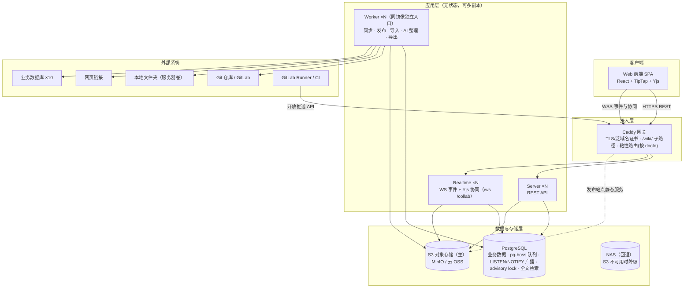
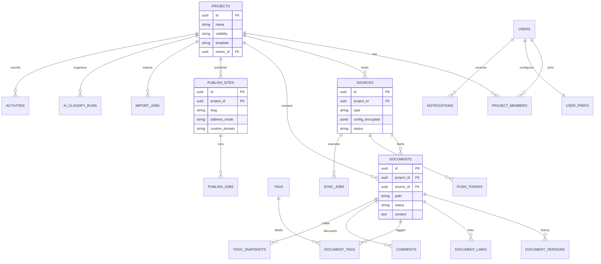
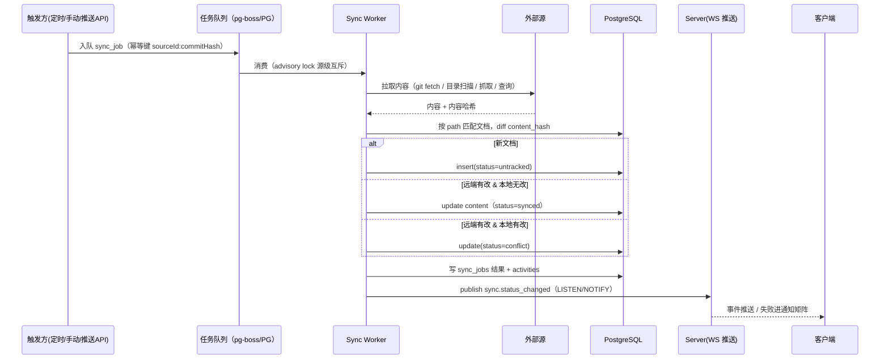
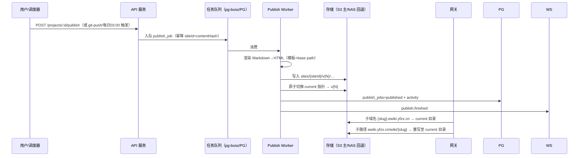
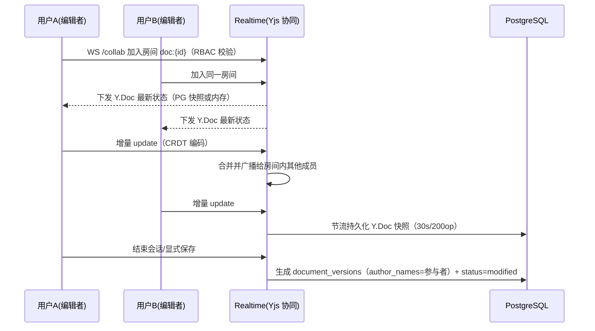
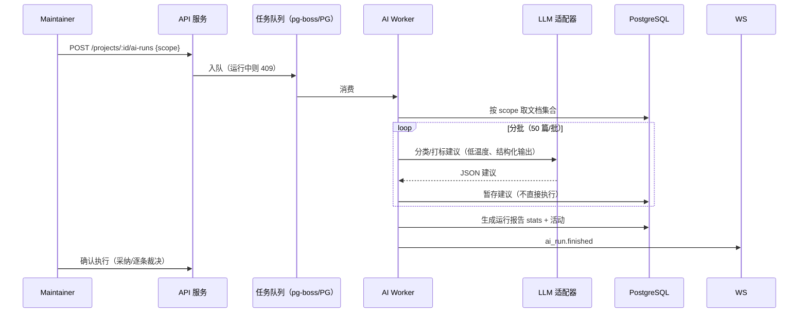
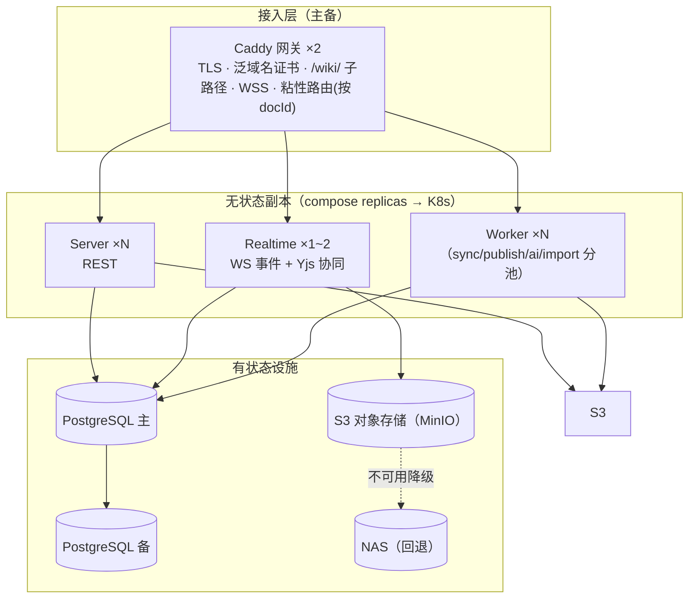

# ewiki 软件设计文档（SDD）

| 项 | 说明 |
| --- | --- |
| 文档目的 | 定义 ewiki 的系统架构、模块边界、接口契约、数据模型与非功能设计，作为前后端开发（层 3/4）的实施蓝图 |
| 创建日期 | 2026-09-06 |
| 上游基线 | [PRD](./PRD.md)（R4，2026-09-06）；高保真原型 `prototype-docvault`（React 单页应用，交互细节参照） |
| 阅读对象 | 架构评审、前后端工程师、AI 开发代理、DevOps、QA |
| 修订记录 | R1（2026-09-06）：初版。R2（2026-09-06）：技术选型修订——按"如非必要勿增实体"收敛 Phase 1 为 4 容器最小实体集（Hono/Drizzle/pg-boss/Caddy，淘汰 Redis/MinIO/独立实时服务），附录市场调研依据；新增 ADR-8/9/10。R3（2026-09-06）：架构讨论决议三项——数据库方言边界（PG 起步 + 四接口，ADR-11）；存储双轨上移 Phase 1（S3 主 + NAS 回退，ADR-12）；REST/WS 阶段一即拆分（ADR-13）；部署实体 6 容器 |

**证据标注约定**：全文设计决策与约束使用四类标注——`[Data-backed]`（来自 PRD/原型的可验证事实）、`[Research-backed]`（公开标准或行业实践，注明来源）、`[Expert judgment]`（工程推断）、`[Hypothesis]`（待验证假设）；无法核实的技术细节标注 `[To be confirmed]` 或 `[Unverified — requires human review]`。

---

## 1 设计概述

### 1.1 文档定位分类

| 维度 | 分类 |
| --- | --- |
| 文档类型 | 组合型：技术架构（主干）+ 接口设计 + 数据库设计要素 |
| 系统阶段 | 绿地系统（原型已完成，代码从零开始） |
| 复杂度 | Heavyweight（多模块、实时协同、发布管线、多副本部署） |
| 上游工件 | PRD R4（含 8.4 节 14 条待确认项） |

### 1.2 目的与范围

本设计覆盖：Web 管理平台（前端 + 服务端）、数据源同步引擎、发布管线、实时协同编辑、开放推送 API、多副本无状态部署。

本设计不覆盖：移动端、桌面端与离线模式的实现方案（仅给出架构预留，见 7.4）、AI 模型本身的训练与选型细节（仅定义适配器边界）、企业 OA/SSO 对接的具体协议（仅预留接口层）。

### 1.3 需求追踪（模块 ↔ PRD 功能编号）

| 设计模块 | 对应 PRD 功能 |
| --- | --- |
| 项目与成员 | F05、F23、F28、F50–F52 |
| 文档与版本 | F06–F09、F11–F13、F46–F48 |
| 渲染与主题 | F14–F15、F37–F41 |
| 数据源与同步 | F18–F22、F43、F20（开放推送 API） |
| AI 智能整理 | F26 |
| 内容导入 | F27 |
| 知识图谱 | F29–F32 |
| 发布管线 | F33–F36 |
| 实时协同 | F17、F53 |
| 全局框架与通知 | F01–F04、F16、F42、F44–F45、F49 |

### 1.4 目标与约束

- **多副本无状态部署**（PRD 8.1 部署形态）：任一无状态副本可水平扩展，避免单点故障 `[Data-backed，PRD R3]`
- **发布双地址形态**：子域名 `{slug}.ewiki.yfzx.cn` 与子路径 `ewiki.yfzx.cn/wiki/{slug}` `[Data-backed，PRD R4]`
- **开放推送 API**：GitLab Runner 可自动推送更新 `[Data-backed，PRD R3]`
- **实时协同编辑**：P1 交付，单文档并发上限建议 ≤ 10 人 `[Assumption，PRD 8.3]`
- **本期不做商业化**：无计费/订阅模块 `[Data-backed，PRD 4.1]`
- **数据库方言边界**：队列/锁/广播/检索经 JobQueue/LockService/EventBus/SearchService 四接口隔离，PostgreSQL 为 Phase 1 默认实现，国产库触发时切换方言实现 `[Data-backed：用户决策 R3]`
- **存储双轨**：S3 为主 + NAS 故障回退（补偿回迁），Phase 1 即部署 `[Data-backed：用户决策 R3]`
- **实时拆分**：REST 与 WS 阶段一即分服务部署 `[Data-backed：用户决策 R3]`
- 规模假设：首年 ≤ 200 项目、≤ 10 万文档、单文档 ≤ 1 MB、峰值并发用户 ≤ 500 `[Hypothesis]`

### 1.5 术语表

| 术语 | 定义 |
| --- | --- |
| 源（Source） | 文档内容的来源系统：Git 仓库、本地文件夹、网页链接、数据库（10 种） |
| 同步（Sync） | 从源拉取内容并转化为平台文档的任务，含冲突检测 |
| 推送令牌（Push Token） | 开放推送 API 的按源发放的鉴权凭证 |
| 发布站点（Site） | 项目对外只读站点的发布配置与产物集合 |
| 托管地址 | 平台持有的站点地址：子域名或子路径两种形态 |
| 协同会话 | 多人通过 CRDT 文档同时编辑的实时会话 |
| Y.Doc | Yjs 协同文档的内存/持久化状态对象 |

---

## 2 系统架构

### 2.1 架构风格

采用**模块化单体（Modular Monolith）+ Worker 分池**的架构，而非微服务。理由：团队规模小、需求仍在快速演化，微服务的分布式事务与运维成本不匹配；单体内按限界上下文划分模块获得清晰边界，重负载任务（同步、发布、AI 整理、导入）独立为 Worker 进程消费队列，与 API 进程分开伸缩——这直接满足"多副本无状态、避免单点"的部署约束 `[Expert judgment]`。实时能力（WS 事件与 Yjs 协同）为独立 realtime 服务（ADR-13），与 REST 经网关按路径分流。

### 2.2 架构图（Phase 1）



**图示走读**：客户端只与 Caddy 对话，网关按路径分流——REST 转发 Server 副本，`/ws` 与 `/collab` 转发 Realtime 副本（按 docId 粘性路由保证同文档房间落同一实例）；GitLab Runner 经网关调用开放推送 API。三类副本全部无状态，经方言边界四接口（JobQueue/LockService/EventBus/SearchService，见 2.4）访问 PostgreSQL——队列、广播、锁、检索不因换库而扩散。存储双轨：StorageService 以 S3 为主，写失败降级 NAS 并打补偿标记、读 miss 回退 NAS，补偿任务负责回迁；发布产物由 Caddy 从 S3 直接静态服务。Phase 1 部署实体 **6 容器**（caddy/server/realtime/worker/postgres/minio）+ 既有 NAS 设施 `[Expert judgment]`。

### 2.3 组件职责与边界

| 组件 | 拥有（Responsibility） | 不拥有（Boundary） | 依赖 |
| --- | --- | --- | --- |
| Caddy 网关 | TLS 终止、泛域名与子路径路由、静态前端资源与发布站点文件服务、负载均衡、WSS 升级、按 docId 粘性路由 | 无业务逻辑 | 各副本、S3 |
| Server（无状态） | REST 资源 CRUD、鉴权与 RBAC 裁决、任务入队（pg-boss） | 不承载实时连接；不直接执行同步/发布等长任务 | PG、存储 |
| Realtime（无状态） | WS 连接与房间订阅、事件广播（LISTEN/NOTIFY）、Yjs 协同会话与快照节流落库 | 不承载 REST；不做业务裁决 | PG、存储 |
| Worker（无状态） | 源同步、冲突处理、发布构建、导入、AI 整理、导出、链接扫描（图谱数据） | 不直接响应客户端请求 | PG、存储、外部源 |
| PostgreSQL | 业务事实源；pg-boss 队列；LISTEN/NOTIFY 广播；advisory lock；全文检索——均经方言边界四接口访问 | 不存大文件（产物/附件走 S3/NAS） | — |
| 存储（S3 主 / NAS 回退） | 站点产物版本目录、图片附件、ZIP 导出 | 不存 Y.Doc 快照（快照随 PG 主库） | — |

### 2.4 技术选型（R2/R3 修订：分阶段选型）

**选型原则**：前期服务压力较小，遵循"如非必要勿增实体"——每个额外的有状态组件都是部署、备份、监控、排障四重成本；以最快速度落地产品原型，扩展路径预置但不预建 `[Expert judgment]`。

**市场调研摘要**（检索于 2026-09）：

- 任务队列：Postgres 原生队列在 2026 年成为团队收敛方向——每个额外的有状态服务都意味着供应、加固、打补丁、监控、备份的持续成本，单库同时覆盖备份/恢复/连接池/可观测性；pg-boss 12（SKIP LOCKED 的 exactly-once、指数退避、cron、死信队列、LISTEN/NOTIFY 低延迟投递、Drizzle/Prisma 事务适配器）持续高频维护（v12.29，检索时 2 天前发布）。来源：[npmjs: pg-boss](https://www.npmjs.com/package/pg-boss)、[hirenodejs.com（2026-06）](https://www.hirenodejs.com/blog/nodejs-pgboss-postgres-job-queues-2026)。`[Research-backed]`
- 后端框架：Hono 周下载约 34.5M（2026），TypeScript 一等公民、Web 标准模型、体积约 7.4KB；Fastify 内置 schema 校验、官方基准延迟最低（10.84ms，2026-08 更新）；NestJS 适合大团队强规范，对小项目偏重、学习曲线陡。来源：[pkgpulse.com（2026-04）](https://www.pkgpulse.com/guides/hono-vs-fastify-vs-nestjs-2026)、[fastify.dev/benchmarks](https://fastify.dev/benchmarks/)。`[Research-backed]`
- ORM：2026-05 Drizzle 周下载量首次超越 Prisma；Drizzle 零 codegen、零依赖、约 7.4KB，schema 即 TypeScript；Prisma 7（2025-11）移除 Rust 引擎后差距缩小，但抽象层级更重。来源：[adeptdev.io（2026-07）](https://www.adeptdev.io/blogs/drizzle-vs-prisma-2026-honest-comparison-typescript-developers)、[omiid.me（2026-08）](https://omiid.me/notebook/48/drizzle-orm-vs-prisma)。`[Research-backed]`

**Phase 1 选型表**：

| 决策点 | Phase 1 选择 | 理由 | 标签 |
| --- | --- | --- | --- |
| 运行时 | Node.js 22 LTS（TypeScript） | pg-boss 12 要求 Node ≥ 22.12；与前端同语言，类型跨端共享 | `[Data-backed：pg-boss 引擎要求]` |
| 后端框架 | Hono（@hono/node-server） | 极轻（~7.4KB）+ Zod 校验一等集成 + Web 标准可移植（远期桌面端可复用 API 层）；Fastify 为备选（插件生态更全、延迟基准略优） | `[Research-backed]` |
| 参数校验 | Zod | 前后端共享 schema 与类型推导，一处定义两端受益 | `[Expert judgment]` |
| ORM | Drizzle | SQL-first、零 codegen、零依赖；`fromDrizzle` 适配器实现"业务写入与任务入队同事务原子提交"；~20 表规模下类型推导成本可控 | `[Research-backed]` |
| 队列/定时/死信 | pg-boss 12（Postgres 内） | 淘汰 Redis：与业务同库事务原子入队（消除双写）、重试/退避/cron/死信齐全、备份监控与业务同体 | `[Research-backed]` |
| 跨副本广播 | PG LISTEN/NOTIFY | WS 事件与协同通知的低延迟广播，零新增实体 | `[Research-backed：pg-boss 同机制]` |
| 源级互斥 | PG advisory lock | 同一源不并发同步 | `[Expert judgment]` |
| 实时服务 | 独立 realtime 服务（ws + Yjs，/ws 与 /collab） | REST/WS 阶段一即拆分（用户决策 R3）；realtime ×1~2，Caddy 按 docId 粘性路由，多副本房间迁移为 Phase 2 | `[Data-backed]` |
| 协同持久化 | Y.Doc 快照 → PG bytea（节流） | 单文档 ≤1MB 假设下 PG 足够；Phase 2 经 StorageService 迁对象存储 | `[Assumption]` |
| 文件存储 | StorageService 双适配器：S3 主（MinIO/云 OSS）+ NAS 故障回退 | 写 S3 失败落 NAS 并打补偿标记、读 miss 回退 NAS、补偿任务回迁（用户决策 R3） | `[Data-backed]` |
| 网关 | Caddy | 自动 HTTPS、泛域名/on-demand TLS（覆盖发布双地址形态）、静态文件与反向代理一体，单二进制 | `[Expert judgment]` |
| 数据库 | PostgreSQL 16+ | 事实源 + 队列 + 广播 + 锁 + 全文检索一体化 | `[Expert judgment]` |
| 数据库方言边界 | JobQueue/LockService/EventBus/SearchService 四接口，PG 实现为默认 | 国产库硬性部署时切换方言：MySQL 系（OceanBase/TiDB/GaussDB）=自研 SKIP LOCKED 队列 + GET_LOCK + 事件表轮询 + ngram 检索；PG 系（人大金仓/openGauss）直兼容（用户决策 R3） | `[Data-backed]` |
| 全文检索 | tsvector + pg_trgm | 不引入独立搜索引擎；预留 Meilisearch 路径 | `[Expert judgment]` |
| 认证 | 自研最小 JWT（jose）+ refresh_tokens 表 | 勿增实体；better-auth 为备选 `[To be confirmed]` | `[Expert judgment]` |
| 凭据加密 | AES-256-GCM，主密钥来自环境/KMS `[To be confirmed：KMS 选型]` | 数据源密码不落明文（PRD 8.2） | `[Expert judgment]` |
| 前端 | React 19 + Vite + Tailwind + TanStack Query + Zustand | 沿用原型栈，原型代码直接迁移；服务端状态与 UI 状态分别由 Query/Zustand 承载 | `[Data-backed]` |
| 编辑器 | TipTap + y-prosemirror + Yjs | 所见即所得（F13）+ CRDT 协同（F17）+ 离线同源 | `[Research-backed]` |
| AI 适配器 | AiProvider 接口 | 服务商与模型待定 | `[To be confirmed]` |

**Phase 1 部署实体**：`caddy + server + realtime + worker + postgres + minio(S3)` 共 **6 个容器** + 既有 NAS 设施（回退存储；server/realtime/worker 同镜像不同入口，不新增构建物）。

**Phase 2 扩展触发与路径**（压力到来逐项加回，接口不变）：

| 触发条件 | 动作 |
| --- | --- |
| 队列吞吐/延迟接近 pg-boss 瓶颈 | 引入 Redis（BullMQ）或拆分专用队列库；广播迁 Redis Pub/Sub |
| 实时多副本房间迁移 | 按 docId 粘性路由扩容 / Y.Doc 房间迁移协议 |
| 检索质量/规模不足 | 引入 Meilisearch（中文分词原生友好） |
| 国产库硬性部署要求 | 启用对应方言实现（见上"数据库方言边界"） |
| 多主机多副本 | 编排迁移 K8s（存储已双轨） |

### 2.5 代码仓库结构

pnpm monorepo `[Expert judgment：原型可整体迁移进 apps/web]`：

```
ewiki/
├─ apps/web        # 前端 SPA（迁移自 prototype-docvault）
├─ apps/server     # 服务端（Hono：REST API，按模块划分限界上下文）
├─ apps/realtime   # 实时服务（WS 事件 + Yjs 协同；独立入口）
├─ apps/worker     # Worker 进程（与 server/realtime 共享领域层；同镜像不同入口）
├─ packages/shared # DTO / 枚举 / 状态机定义（前后端共享）
├─ packages/theme  # 主题令牌与 8 套 UI 主题
└─ packages/editor # TipTap 编辑器封装 + y-prosemirror 绑定
```

模块清单（server 内部限界上下文）：`auth`、`users`、`projects`、`members`、`documents`、`versions`、`sources`、`sync`、`publish`、`graph`、`ai`、`imports`、`notifications`、`search`、`open-api`（开放推送）。依赖方向单向：`open-api → sync → sources → documents → projects`，无环。realtime 服务包含 `realtime-gateway`（WS 连接/房间/广播）与 `collab`（Yjs 会话与快照）两个模块，与 server 共享领域层。

---

## 3 数据设计

### 3.1 ER 图



**图示走读**：`PROJECTS` 是聚合根；`SOURCES` 按项目绑定并喂养 `DOCUMENTS`（一个文档归属一个源，手动创建的文档源为空表示"平台原生"）；`DOCUMENT_VERSIONS` 保存不可变历史；`DOCUMENT_LINKS` 由链接扫描任务维护，是知识图谱（F29–F32）的数据来源，断链即 `broken=true` 的记录；`PUBLISH_SITES` 与 `PUBLISH_JOBS` 分离"配置"与"执行"；`PUSH_TOKENS` 支撑开放推送 API 的按源鉴权；协同状态经 `YDOC_SNAPSHOTS` 落地，会话历史不进关系表（见 5.3）。

### 3.2 核心表定义

约定：所有表含 `id uuid PK (gen_random_uuid())`、`created_at/updated_at timestamptz`；软删除用 `deleted_at`（仅 projects/documents/sources）。下列为业务字段。

| 表 | 字段（类型，约束） | 说明 |
| --- | --- | --- |
| users | email text UNIQUE NOT NULL；name text；password_hash text；global_role text CHECK(admin/user) DEFAULT 'user'；avatar_url text；status text | 全局账号角色对应 PRD 2.1"管理员/普通用户"；企业 OA 对接预留 `sso_subject text NULL` |
| refresh_tokens | user_id FK；token_hash text；expires_at timestamptz；revoked_at NULL | 刷新令牌旋转与吊销落库（Phase 1 以 PG 替代 Redis 黑名单） |
| user_prefs | user_id UUID PK FK；theme text；appearance text；accent text；font_size int；prefs jsonb（通知矩阵、源默认、快捷键偏好） | PRD F41–F44 的用户级偏好，单表 JSONB（无跨表查询需求） |
| projects | name text NOT NULL；description text；color text；visibility text CHECK(private/team/public)；template text；owner_id FK users；archived bool | slug 不在项目上——发布地址属于 publish_sites |
| project_members | project_id FK + user_id FK UNIQUE；role text CHECK(owner/maintainer/editor/guest)；invited_by FK；status text CHECK(active/pending) | 项目角色唯一事实源（PRD 8.4-4：移除原型回退逻辑） |
| sources | project_id FK；type text CHECK(git/local/web/database)；name text；config_encrypted jsonb（**应用层 AES-256-GCM 加密后整体存储**，含认证字段）；default_branch text；auto_sync bool；interval_seconds int CHECK(1800/3600/21600/86400/0=manual)；status text CHECK(connected/synced/syncing/error)；last_synced_at；last_error text | 统一同步间隔枚举（PRD 8.4-3 决议）；config 明文字段（如仓库地址、分支）单列 `config_public jsonb` 便于展示 |
| push_tokens | source_id FK；token_hash text（SHA-256）；scopes text[]；last_used_at；revoked_at NULL | 开放推送 API 凭证；明文只在创建时返回一次 |
| sync_jobs | source_id FK；trigger text CHECK(manual/schedule/push)；commit_hash text NULL；status text CHECK(queued/running/succeeded/failed)；stats jsonb；error text；idempotency_key text UNIQUE | 推送 API 幂等键 = `{sourceId}:{commitHash}` |
| documents | project_id FK；source_id FK NULL；path text NOT NULL；title text；content text（当前版本 Markdown）；content_hash text；status text CHECK(untracked/synced/modified/conflict)；word_count int；updated_by FK | UNIQUE(project_id, path)；全文检索列 `search tsvector GENERATED`（title+content） |
| document_versions | document_id FK；version_no int；commit_hash text NULL；author_id FK；author_names text[]（协同会话参与者）；message text；content text（整快照）；changed_summary jsonb | UNIQUE(document_id, version_no)；版本不可变（PRD F47 回滚=生成新版本） |
| document_links | from_document_id FK；to_document_id FK NULL；external_url text NULL；broken bool | CHECK(恰一：to_document_id 或 external_url)；图谱数据源 |
| document_tags / tags | tags(project_id, name UNIQUE)；document_tags(document_id, tag_id) PK 复合 | 标签 AND 筛选（F08）基于 join |
| comments | document_id FK；author_id FK；body text；resolved bool；anchor jsonb NULL | 基础结构；锚点细节属 PRD 8.4-1 遗留 `[Hypothesis]` |
| ydoc_snapshots | document_id FK；state bytea（Y.Doc 二进制快照）；state_vector bytea；updated_at | 协同状态持久化（5.3 节）；快照保持 PG 存储（体积小、随库备份），不纳入 S3/NAS 双轨 |
| publish_sites | project_id FK UNIQUE；mode text CHECK(hosted/custom)；slug text（hosted 必填 UNIQUE）；address_mode text CHECK(subdomain/subpath)；custom_domain text UNIQUE NULL；custom_server text NULL；schedule text CHECK(git-push/daily/manual)；auto_sync bool；current_version int NULL | 双地址形态（PRD R4）；custom_domain 唯一即全局占用校验 |
| publish_jobs | site_id FK；version_no int；content_hash text；status CHECK(queued/building/uploading/published/failed)；commit_hash text；artifact_ref text（存储版本目录，S3/NAS 由 StorageService 决定）；error text | 原子发布见 5.2 |
| import_jobs | project_id FK；importer text CHECK(web-crawler/notion/obsidian/folder)；params jsonb；status；progress int；stats jsonb；error text | 网页爬取参数校验上限 3 层/500 页 |
| ai_classify_runs | project_id FK；scope text CHECK(all/inbox)；status；stats jsonb（scanned/folders_created/docs_relocated/tags_added）；started_by FK | F26 |
| activities | project_id FK NULL（全局动态为 NULL）；actor_id FK；verb text CHECK(comment/sync/publish/edit/delete/create)；target_type text；target_id uuid；target_title text；meta jsonb | 驱动 F03/F49 与通知（PRD 8.4 决议：动词枚举与原型对齐） |
| notifications | user_id FK；type text；payload jsonb；read_at NULL | 站内通知（F42 事件矩阵落库于 user_prefs） |
| audit_logs | actor_id；action text；resource_type；resource_id；ip；meta jsonb | 覆盖：删除项目、角色变更、凭据变更、推送令牌管理（PRD 8.2） |

 starter packs 不建表——8 个预设包为代码内置种子数据（只读接口下发）`[Expert judgment]`。

### 3.3 一致性与事务边界

- **强一致（PG 事务）**：文档保存+版本写入、成员角色变更、发布配置变更；状态机迁移（6.3 PRD）由应用层守卫 + DB CHECK 双重约束。
- **最终一致**：搜索索引（同事务更新 tsvector，重建任务兜底）、图谱链接（异步扫描任务）、动态/通知投递（队列，至多一次 + 前端幂等去重）。
- **幂等键**：sync_jobs.idempotency_key、publish_jobs(site_id, content_hash)、写接口支持 `Idempotency-Key` 头。

### 3.4 索引策略

- documents：`GIN(search)` 全文、`(project_id, status)`、`(project_id, path)` 唯一、`(source_id)`、`(updated_at DESC)`。
- document_versions：`(document_id, version_no DESC)`。
- activities：`(project_id, created_at DESC)`、`(verb)`。
- sync_jobs / publish_jobs：`(status, created_at)`（Worker 扫描）、`idempotency_key` 唯一。
- publish_sites：`slug` 唯一、`custom_domain` 唯一。
`[Expert judgment]`

---

## 4 接口设计

### 4.1 通用约定

| 约定 | 内容 |
| --- | --- |
| Base Path | `/api/v1`（破坏性变更升 `/v2`，旧版本保留 ≥ 6 个月弃用窗口 `[Assumption]`） |
| 鉴权 | 管理接口：`Authorization: Bearer <accessToken>`；开放推送 API：`Authorization: EwikiPush <pushToken>` |
| 令牌 | 访问令牌 JWT（15 分钟 `[Assumption]`，jose 签发）+ 刷新令牌（7 天，refresh_tokens 表旋转与吊销） |
| 响应信封 | 成功直接返回资源；错误统一 `{ code, message, details?, requestId }` |
| 分页 | `?page=&pageSize=`（默认 20，上限 100）→ `{ items, page, pageSize, total }` |
| 时间 | ISO 8601 UTC |
| 幂等 | 任务类写接口接受 `Idempotency-Key` 头 |

**错误码表**：

| HTTP | code | 场景 |
| --- | --- | --- |
| 400 | VALIDATION_FAILED | 参数校验失败 |
| 401 | UNAUTHENTICATED / TOKEN_EXPIRED | 未认证/过期 |
| 403 | FORBIDDEN | 角色不足（RBAC 矩阵见 6.3） |
| 404 | NOT_FOUND | 资源不存在 |
| 409 | CONFLICT / SLUG_TAKEN / DOMAIN_TAKEN / SOURCE_SYNCING / EDIT_CONFLICT / IN_COLLAB_SESSION | 状态冲突 |
| 422 | IMPORT_PARAMS_INVALID | 导入参数越限（>3 层或 >500 页） |
| 429 | RATE_LIMITED | 限流 |
| 500 | INTERNAL | 服务端错误 |
| 502 / 504 | SOURCE_UNREACHABLE / SOURCE_TIMEOUT | 外部源不可达/超时 |

### 4.2 接口清单

| # | 方法与路径 | 用途 | 鉴权/最低角色 | 契约要点 |
| --- | --- | --- | --- | --- |
| A1 | POST /auth/login | 登录 | 匿名 | body `{email, password}` → `{accessToken, refreshToken, user}`；错误 401 |
| A2 | POST /auth/refresh | 刷新令牌 | refreshToken | 旋转刷新令牌；旧令牌标记 revoked |
| A3 | POST /auth/logout | 登出 | Bearer | 刷新令牌标记 revoked |
| A4 | GET /me · PATCH /me · POST /me/avatar | 个人资料 F40 | Bearer | avatar 限 JPG/PNG、256×256、≤2MB（服务端校验），超限 400 |
| A5 | GET/PATCH /me/preferences | 偏好 F41–F44 | Bearer | partial merge 语义 |
| P1 | GET /projects | 项目列表 | Bearer | 按可见性过滤（private 仅 Owner/Maintainer） |
| P2 | POST /projects | 新建项目 F05 | Bearer | body `{name*, description, visibility, template, source?}` → 201 |
| P3 | GET /projects/:id | 项目详情 | 成员或可见性规则 | 含聚合统计（文档数等） |
| P4 | PATCH /projects/:id | 基本设置 F23 | Maintainer+ | visibility 变更写审计日志 |
| P5 | DELETE /projects/:id | 删除项目 F28 | **Owner 仅** | 软删除 + 级联标记；二次确认由前端承担 |
| P6 | POST /projects/init-from-starter | StarterPack 初始化 F10 | Bearer | body `{packKey, name, source{...}}` → 201 项目 |
| M1 | GET/POST /projects/:id/members · PATCH/DELETE /projects/:id/members/:userId | 成员管理 F50–F51 | Owner（变更）/ Maintainer+（查看邀请） | PATCH body `{role}`；Owner 不可被降级（403） |
| D1 | GET /projects/:id/documents | 文档列表 F06–F09 | 查看角色 | query：`status[]`、`tags[]`（AND）、`updatedSince`、`q`、`scope=flat/project` |
| D2 | POST /projects/:id/documents | 新建文档 F12 | Editor+ | body `{path*, title, content?}`；path 冲突 409 |
| D3 | GET /documents/:id | 文档详情/内容 F13 | 查看角色 | `?version=` 可取历史版本内容 |
| D4 | PATCH /documents/:id | 保存文档 | Editor+ | body `{content, baseContentHash}`；hash 不匹配 409 EDIT_CONFLICT（乐观锁；协同会话内不需要） |
| D5 | DELETE /documents/:id | 删除文档 | Maintainer+ | 软删除 |
| D6 | GET /documents/:id/versions | 版本时间线 F46 | 查看角色 | `?docId=&q=&author=` 聚合版见 V2 |
| D7 | POST /documents/:id/rollback | 回滚 F47 | Editor+ | 生成新版本，body `{toVersion}` |
| D8 | GET /documents/:id/links | 文档链接 | 查看角色 | 图谱局部数据 |
| T1 | GET /projects/:id/tags | 标签 | 查看角色 | 筛选抽屉数据源 |
| S1 | GET /sources · POST /sources | 源列表/创建 F18–F19 | Maintainer+（列表）· Maintainer+（创建） | POST 按 type 校验 config（分支图见 PRD 6.2.4）；敏感字段响应中永不出现在 config_public |
| S2 | PATCH/DELETE /sources/:id | 源编辑/删除 F22 | Maintainer+ | 认证字段留空=不修改；回显掩码 |
| S3 | POST /sources/:id/sync | 立即同步 F22 | Maintainer+ | → 202 `{jobId}`；syncing 中重复触发 409 SOURCE_SYNCING |
| O1 | POST /open/sources/:sourceId/push | **开放推送 API** | EwikiPush 令牌 | 详见 4.3 |
| G1 | GET /projects/:id/graph | 图谱 F29 | 查看角色 | `?view=explore/orphans/hubs`；返回 nodes/edges/stats；规模超限 200+`truncated:true` 降级 |
| AI1 | GET /projects/:id/ai-runs · POST /projects/:id/ai-runs | AI 整理 F26 | Maintainer+ | POST body `{scope}` → 202 `{runId}`；运行中再触发 409 |
| I1 | GET/POST /projects/:id/import-jobs | 导入 F27 | Maintainer+ | POST body `{importer, params}`；爬取越限 422 |
| PU1 | GET/PUT /projects/:id/publish-site | 发布配置 F35 | Maintainer+ | PUT body 含 `mode/addressMode/slug/customDomain/customServer/schedule/autoSync`；slug/域名冲突 409 |
| PU2 | POST /projects/:id/publish | 执行发布 F36 | Maintainer+ | → 202 `{jobId}`；幂等 `Idempotency-Key` |
| PU3 | GET /projects/:id/publish-jobs | 发布历史 | 查看角色 | 含 commit_hash、版本号 |
| T2 | GET /templates · GET /starter-packs | 模板/预设包 F34/F10 | Bearer | 种子数据只读 |
| N1 | GET /projects/:id/activities · GET /activities | 动态 F03/F49 | 查看角色 | 动态页 query：`verb[]` |
| N2 | GET /notifications · POST /notifications/read | 通知 | Bearer | read body `{ids[]}` |
| X1 | POST /projects/:id/export | 导出 ZIP F45 | Maintainer+ | 异步 → 202；完成经通知+存储链接 |
| SE1 | GET /search | 全局搜索 | Bearer | `?q=&type=project/document` |
| SYS | GET /healthz · GET /readyz | 健康检查 | 匿名 | 探针：PG 依赖检查（Phase 1 唯一有状态设施） |

### 4.3 核心接口详细契约

#### O1 开放推送 API（PRD F20 / R3）

| Field | Value |
| --- | --- |
| Operation | `POST /api/v1/open/sources/{sourceId}/push` |
| Purpose | GitLab Runner/CI 在流水线中通知平台拉取最新提交并触发同步 |
| Auth | `Authorization: EwikiPush <pushToken>`；令牌按源发放，SHA-256 落库（`push_tokens`），可吊销/轮换 |
| 防重放 | 头 `X-Ewiki-Timestamp`（Unix 秒，与服务端偏差 ≤ 300s）+ `X-Ewiki-Signature = HMAC-SHA256(token, timestamp + body)` |
| Path 参数 | `sourceId`（UUID，须为 git 类型源） |
| Request body | `{ "branch": "main"（可选，默认源配置分支）, "commitHash": "a1b2c3"（可选，幂等与拉取定位） }` |
| Success | `202 Accepted`；body `{ "jobId": "uuid", "deduped": false }`；重复 commitHash 返回 `200` + `deduped: true` |
| Error codes | 401 TOKEN_INVALID / TOKEN_REVOKED；403 SOURCE_TYPE_MISMATCH（非 git 源）；404；409 SOURCE_SYNCING；429；502 SOURCE_UNREACHABLE |
| 幂等 | `sync_jobs.idempotency_key = sourceId:commitHash` 唯一约束兜底 |

GitLab CI 配置示例：

```yaml
publish-docs:
  stage: deploy
  script:
    - >-
      curl -sf -X POST "https://api.ewiki.yfzx.cn/api/v1/open/sources/${EWIKI_SOURCE_ID}/push"
      -H "Authorization: EwikiPush ${EWIKI_PUSH_TOKEN}"
      -H "X-Ewiki-Timestamp: $(date +%s)"
      -H "X-Ewiki-Signature: $(printf "%s%s" "$(date +%s)" "$CI_COMMIT_SHA" | openssl dgst -sha256 -hmac "$EWIKI_PUSH_TOKEN" -binary | xxd -p -c 64)"
      -H "Content-Type: application/json"
      -d "{\"branch\":\"$CI_COMMIT_BRANCH\",\"commitHash\":\"$CI_COMMIT_SHA\"}"
```

#### D4 保存文档（非协同路径）

| Field | Value |
| --- | --- |
| Operation | `PATCH /api/v1/documents/{id}` |
| Auth | Bearer；项目角色 ≥ Editor |
| Request body | `{ "content": "markdown", "baseContentHash": "sha256..." }` |
| 语义 | `baseContentHash` 与服务端当前一致则落库并生成版本（author=当前用户）；不一致 → `409 EDIT_CONFLICT`，body 携带服务端内容摘要供对比面板（PRD F43 冲突策略） |
| Success | `200`；`{ id, contentHash, version: { versionNo, createdAt }, status }`（保存后 status=modified，同步成功后置 synced） |
| 协同例外 | 文档处于协同会话时，保存走 5.3 的 Yjs 快照路径，本接口返回 `409 IN_COLLAB_SESSION` 引导走协同通道 |
| Error codes | 400 / 401 / 403 / 404 / 409 EDIT_CONFLICT·IN_COLLAB_SESSION |

#### PU2 执行发布

| Field | Value |
| --- | --- |
| Operation | `POST /api/v1/projects/{projectId}/publish` |
| Auth | Bearer；Maintainer+ |
| Request body | `{ "versionScope": "current|published", "contentScope": "single|whole", "documentIds?": ["uuid"], "autoSync": true }`（发布目标/调度取自 publish_sites 配置） |
| Success | `202 Accepted`；`{ jobId }`；完成后 WS 事件 `publish.finished` |
| Error codes | 400（未配置发布站点）/ 403 / 409 PUBLISH_RUNNING / 429 |
| 幂等 | `Idempotency-Key` 头；服务端以 `(siteId, contentHash)` 去重 |

#### S3 立即同步

| Field | Value |
| --- | --- |
| Operation | `POST /api/v1/sources/{id}/sync` |
| Auth | Bearer；Maintainer+ |
| Request body | 空（触发配置分支最新内容） |
| Success | `202 { jobId }`；进行中重复调用 `409 SOURCE_SYNCING` |
| 副作用 | 入队 sync_jobs（trigger=manual）；完成/失败经 WS `sync.status_changed` 与通知（失败进 F42 矩阵） |

#### AI1 / I1（任务型接口统一模式）

POST → `202 { runId | jobId }`；GET 列表含 status/progress/stats；同任务运行中再提交 `409`；失败保留 error 可重试（POST 同参重试生成新任务）。AI 运行的模型调用经适配器接口 `AiProvider.generate(prompt, context)`，具体服务商 `[To be confirmed]`。

### 4.4 WebSocket 事件协议（F53 / F17）

| 项 | 设计 |
| --- | --- |
| 连接 | `wss://…/ws?accessToken=…`；鉴权失败关闭码 4401 |
| 房间订阅 | 客户端发送 `{type:"subscribe", room:"project:{id}"|"doc:{id}"|"user:{id}"}`；服务端按 RBAC 校验后加入 |
| 跨副本广播 | 事件经 PG LISTEN/NOTIFY 广播，各 server 副本订阅后投递给本地连接——任意副本可服务，无粘性依赖 `[Research-backed：pg-boss 同机制]` |
| 事件信封 | `{ event, room, payload, at }` |

事件目录：

| event | payload 要点 | 对应 |
| --- | --- | --- |
| activity.created | actor、verb、target | F03/F49 |
| document.updated | docId、status、by | F12 树刷新 |
| sync.status_changed | sourceId、status、error? | F18/F42 |
| publish.finished | siteId、version、address | F36 |
| notification.new | 通知对象 | F42 |
| presence.updated | docId、users[]（光标/选区/姓名） | F17 |

**协同通道**：`/collab` 独立 WebSocket，运行 Yjs 同步协议（y-websocket 兼容）；服务端房间 = 文档 ID；快照节流写入 `ydoc_snapshots`（30s 或 200 op 触发）。断线客户端本地 IndexedDB 保留 Y.Doc 增量，重连自动合并——即 PRD"断线降级单机编辑"的实现载体。

### 4.5 版本管理策略

URL 主版本（/v1）；向后兼容变更（新增可选字段/新端点）原位发布；破坏性变更升 `/v2` 并行运行 ≥ 6 个月 `[Assumption]`；开放推送 API 另有独立令牌生命周期，不随主版本强制升级。

---

## 5 关键流程设计

### 5.1 源同步与冲突处理（F18–F22 / F43 / O1）



**走读**：三种触发（定时、手动、开放推送 API）全部收敛到同一队列任务；源级 `advisory lock` 保证同一源不并发同步（PRD 6.2.4）。冲突判定依据"本地 content_hash 与拉取结果是否分叉"：无分叉直接快进；分叉置 `conflict` 并按项目冲突策略（保留我的/以远端为准/每次询问）执行——`每次询问` 时暂停该文档迁移，待对比面板裁决后写回。链接扫描作为同步收尾步骤重建 `document_links`，供图谱消费。

### 5.2 发布管线（F33–F36 / R4 双地址）



**走读**：发布产物按版本目录写入存储（S3 主、NAS 回退，经 StorageService），`current` 指针切换是唯一发布动作——中断只影响未切换的新版本，线上始终是上一成功版本（PRD 8.3"原子发布"）。双地址形态由网关承接：子域名走泛域名证书与泛解析；子路径由网关重写 `/wiki/{slug}/*` 到对应 `current` 目录，产物的 base path 按 address_mode 构建生成。自定义静态服务器模式下，Worker 将产物推送到用户指定目标（FTP/对象存储/静态主机适配器 `[To be confirmed：首期适配器清单]`），平台仅记录配置与提供跳转。

### 5.3 实时协同编辑会话（F17）



**走读**：协同内容不走 REST 保存（D4 在会话期返回 `409 IN_COLLAB_SESSION`），字符级合并由 CRDT 保证；版本以"会话保存"为粒度生成，作者记录为参与者列表（PRD 6.2.3 假设采纳）。Guest 角色可进入观战房间但服务端拒绝其写操作。单文档并发上限 10 人由房间准入控制实现 `[Assumption，PRD 8.3]`。

### 5.4 AI 智能整理运行（F26）



**走读**：AI 建议默认"生成-确认"两段式，不直接改写文档树——对应 PRD 8.3"误操作"缓解与 7.3"采纳率"指标埋点。自动模式（autoClassify/autoTag 开启）对新增文档走同一路径，置信度低于阈值 `[Assumption：0.7]` 的建议进入人工队列。

---

## 6 非功能设计

### 6.1 性能与容量目标

| 指标 | 目标 | 标签 |
| --- | --- | --- |
| API P95 延迟（读） | ≤ 300ms | `[Hypothesis]` |
| API P95 延迟（写） | ≤ 500ms | `[Hypothesis]` |
| WS 事件端到端 | ≤ 1s | `[Hypothesis]` |
| 千文档整站发布 | ≤ 60s | `[Hypothesis]` |
| 千文档单源同步 | ≤ 5min | `[Hypothesis]` |
| 协同并发 | ≤ 10 人/文档 | `[Data-backed，PRD 8.3]` |

策略：读多写少接口走 PG 索引 + TanStack Query 客户端缓存；同步/发布批量分片；图谱超 5,000 节点时服务端预聚合社区与枢纽字段 `[Hypothesis：阈值待压测]`。

### 6.2 多副本无状态部署（PRD 8.1 硬约束）



**走读**：三类无状态副本独立伸缩（Server 随请求量、Realtime 随连接数、Worker 随队列深度）；副本故障由 Caddy 摘除，队列任务由其他 Worker 接管（pg-boss SKIP LOCKED 支持多消费者安全取任务）。Realtime 多副本按 docId 粘性路由（同一文档房间落同一实例），Y.Doc 房间迁移协议为 Phase 2。会话无本地落盘：JWT 无状态 + 刷新令牌落库；锁与广播在 PostgreSQL。存储双轨：S3（MinIO）为主、NAS 回退，补偿任务回迁。HA：PostgreSQL 主备 + WAL 归档备份；MinIO 单实例起步、按容量演进分布式部署；Caddy 双实例主备 `[Expert judgment]`。

### 6.3 安全设计

- **RBAC 落地**：守卫按"全局角色（管理员）+ 项目角色"双层裁决，矩阵与 PRD 2.2 一致；差异点明确：删除项目/角色变更=Owner；源管理与 AI/导入/发布=Maintainer+；编辑=Editor+；Guest 仅读。API 层强制，前端仅做展示裁剪。
- **凭据加密**：`sources.config_encrypted` 应用层 AES-256-GCM；主密钥来自环境/KMS `[To be confirmed：KMS 选型]`；任何接口不回明文。
- **推送令牌**：SHA-256 存储、创建时一次性返回明文、支持吊销与轮换、HMAC 防重放（4.3 O1）。
- **审计日志**：删除项目、角色变更、凭据与令牌操作全量落 `audit_logs`。
- **公开站点**：静态产物只读、无平台会话 Cookie 注入；子路径形态下站点与平台同域，站点产物禁用平台凭据读取。
- **传输**：全链路 TLS；WSS 同源策略 + 房间 RBAC 校验。

### 6.4 可观测性

结构化日志（pino，requestId 贯穿 API→队列→Worker）；指标（Prometheus：队列深度、同步成功率、发布耗时、WS 连接数、协同房间数；pg-boss 自带 CLI 与 dashboard 观测队列 `[Research-backed]`）；链路（OpenTelemetry `[To be confirmed：采集后端选型]`）；告警基线：同步失败率 > 5%、队列积压 > 1000、PG 主从异常。

### 6.5 错误处理策略

| 类别 | 策略 |
| --- | --- |
| 用户输入错误 | 400 + 字段级 details，不重试 |
| 外部源错误 | 同步任务指数退避重试 5 次（pg-boss）+ 死信队列；连续失败置 source=error 并触发"同步失败"通知；恢复后自动回归 |
| 外部源超时 | 连接 10s、单页抓取 10s、git fetch 10min 上限 |
| 推送 API | 幂等键去重；签名/时间戳校验失败 401，不重试 |
| 发布失败 | 产物残留于 v{N} 目录但不切换 current，线上版本不受影响；失败原因可重试 |
| 协同断线 | 客户端 IndexedDB 保留增量，重连 CRDT 自动合并；极端冲突回退 PRD 6.3 冲突状态机 |
| 基础设施 | PG 不可用 → /readyz 失败摘流；队列与业务同库，任务随库持久化不丢失 |

---

## 7 技术决策记录（ADR 摘要）

| # | 决策 | 备选 | 理由 | 状态 |
| --- | --- | --- | --- | --- |
| ADR-1 | 模块化单体 + Worker 分池 | 微服务 | 团队规模与变更频率；Worker 分池满足独立伸缩 | 采纳 |
| ADR-2 | Yjs（CRDT）协同 | OT（ShareDB 类） | 离线优先与端侧合并契合远期桌面端；免去中心序服务器 | 采纳 |
| ADR-3 | PostgreSQL 一体化：事实源 + 全文检索 + 队列/广播/锁（pg-boss、LISTEN/NOTIFY、advisory lock） | 独立搜索引擎 + Redis | 首年规模下运维实体最少（ADR-8），预留升级路径 | 采纳（R2 扩展） |
| ADR-4 | 发布 = 版本目录 + current 指针 | 直接覆盖写 | 原子性与回滚零成本 | 采纳 |
| ADR-5 | 推送 API = 通知 + 平台拉取 | Runner 直传文件包 | 复用已有 git 凭据与拉取管线，令牌不接触仓库内容 | 采纳 `[Expert judgment]` |
| ADR-6 | 双地址形态并存 | 单一形态 | PRD R4 要求；网关层成本可控 | 采纳，实施细节层 2 细化 |
| ADR-7 | 桌面端预留：内容层（Yjs/本地库）与传输层解耦 | — | 离线模式复用 CRDT 本地持久化（y-indexeddb） | 规划 |
| ADR-8 | Phase 1 实体收敛：Hono/Drizzle/pg-boss/Caddy，PG 承担队列/广播/锁（R3 修订：6 容器，见 ADR-12/13） | 原方案 7 组件（含 Redis/独立实时服务） | 市场调研显示 Postgres 原生队列 2026 成为主流收敛方向，pg-boss 12 高频维护；每个有状态组件都是部署/备份/监控/排障成本；Phase 2 触发条件见 2.4 | 采纳（R2；R3 修订） |
| ADR-9 | 后端框架 Hono（@hono/node-server）+ Zod | NestJS / Fastify | 极轻 TS-first、zod 一等集成、Web 标准可移植（远期桌面端复用）；NestJS 结构成本与当前规模不匹配，Fastify 为插件生态备选 | 采纳（R2） |
| ADR-10 | ORM Drizzle（pg-boss fromDrizzle 原子入队） | Prisma 7 | 零 codegen、零依赖、SQL-first；2026-05 周下载首次超越 Prisma；事务原子入队消除双写 | 采纳（R2） |
| ADR-11 | 数据库方言边界：JobQueue/LockService/EventBus/SearchService 四接口，PG 起步 | 直接 MySQL-first / 双方言并行 | 国产库为保留可能而非硬要求（用户决策 R3）；MySQL 系与 PG 系均有国产对应（OceanBase/TiDB/GaussDB 与人大金仓/openGauss）；切换成本锁死在实现层 | 采纳（R3） |
| ADR-12 | 存储双轨：S3 主 + NAS 故障回退 + 补偿回迁 | 单一主存储 / 按类型分流 | 用户决策 R3：S3 缺失时业务不中断；StorageService 抽象使增量成本约 1-2 天 | 采纳（R3） |
| ADR-13 | REST/WS 阶段一即拆分（realtime 独立服务，Caddy 按 docId 粘性路由） | 同进程合并 | 用户决策 R3：协同连接与 REST 隔离；realtime 模块已独立，拆分增量成本约 1 天 | 采纳（R3） |

---

## 8 PRD 8.4 待确认项 → 设计决议映射

| PRD 8.4 | 设计决议 | 状态 |
| --- | --- | --- |
| 1 协同编辑细节 | CRDT 选 Yjs；并发 ≤10/文档；断线本地编辑+重连合并；版本归属=会话保存（参与者列表）；Guest 观战 `[To be confirmed]`；评论锚点结构遗留 | 部分决议 |
| 2 双轨角色 | `users.global_role`（admin/user）+ `project_members.role`；OA 对接预留 `sso_subject` 与 OIDC 接口层 | 已决议（协议待定 `[To be confirmed]`） |
| 3 同步间隔口径 | 统一枚举 30m/1h/6h/24h/manual（sources.interval_seconds CHECK） | 已决议 |
| 4 成员归属 | `project_members` 为唯一事实源，移除原型回退逻辑 | 已决议 |
| 5 /team 悬空入口 | "邀请成员"引导至当前上下文项目成员页；全局团队页（管理员）预留 `/team` 管理页 `[To be confirmed]` | 建议方案 |
| 6 权限细节 | 删除项目=Owner；角色变更=Owner；源/AI/导入/发布=Maintainer+（4.2 清单已标注） | 已决议 |
| 7 图谱规模 | ≤5,000 节点全量，超限服务端预聚合+截断响应（`truncated`） | 决议（阈值 `[Hypothesis]` 待压测） |
| 8 发布细节 | slug/自定义域名唯一约束；时区=调度按项目所属用户时区 `[To be confirmed]`；原子发布=指针切换；"记录与跳转"=发布配置页域名清单+跳转入口 | 部分决议 |
| 9 快捷键映射 | Windows：Ctrl=N/S/K/P/B/J/Z；Ctrl+Shift=P/Z；Ctrl+Alt=C（与 macOS 一一对应） | 已决议 |
| 10 指标基线 | 埋点事件=同步完成/失败、AI 建议采纳/回滚、冲突解决时长、发布完成、协同会话数；基线值待运营确认 | 设计就绪 |
| 11 排期 | 不在设计范围 | — |
| 12 竞品补全 | 不在设计范围 | — |
| 13 开放推送 API | 契约见 4.3（O1）：EwikiPush 令牌 + HMAC 防重放 + commitHash 幂等 | 已决议 |
| 14 桌面端 | ADR-7：内容层解耦预留，本期不实现 | 规划 |

