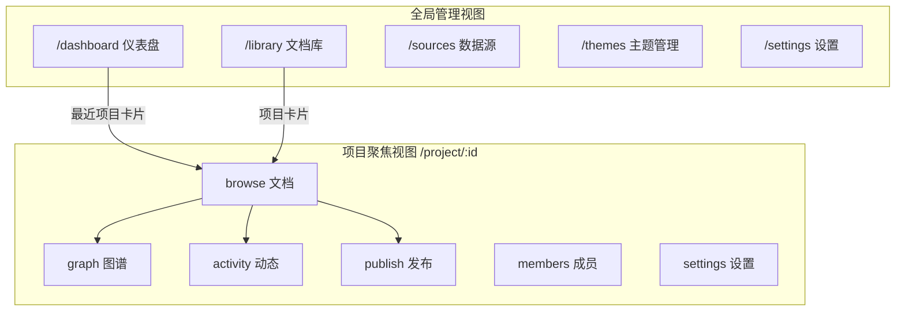
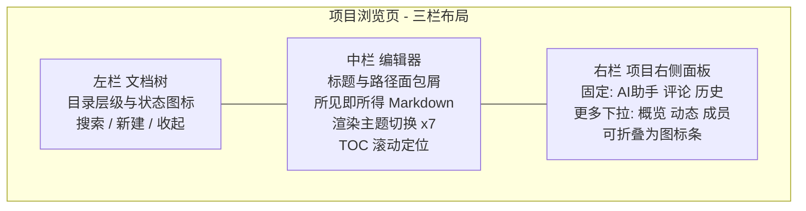
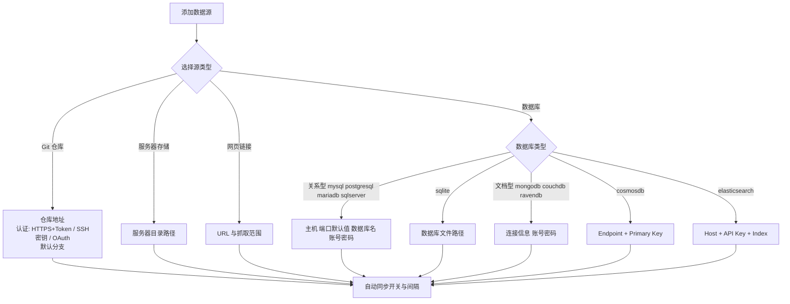
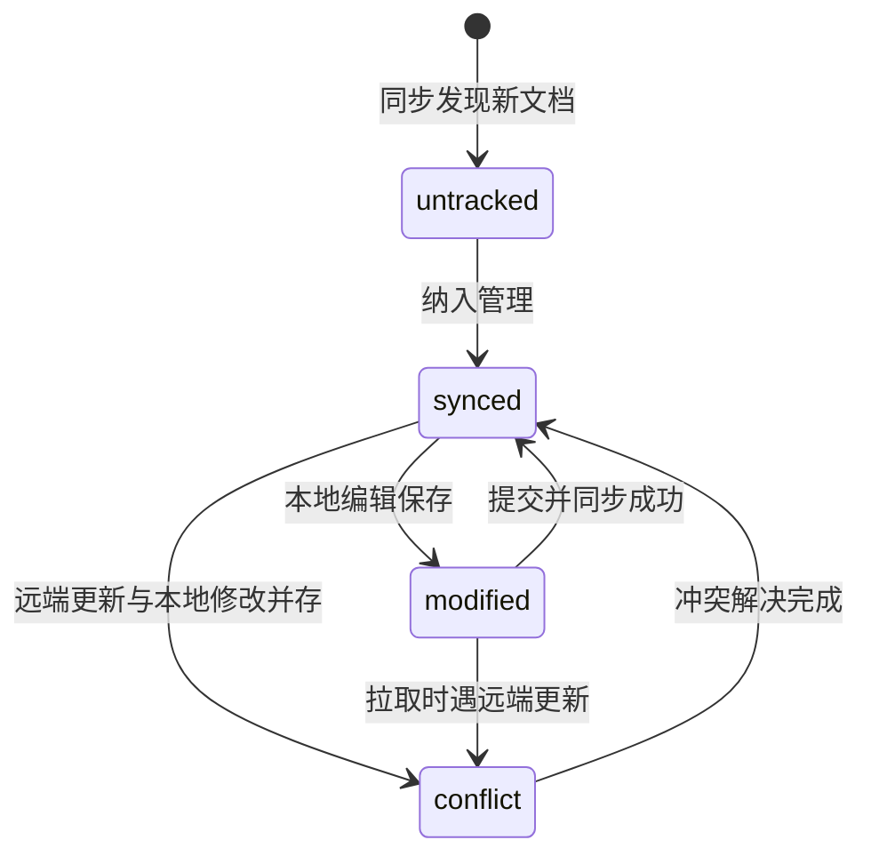
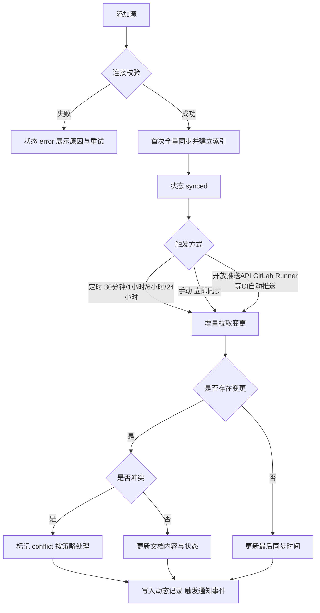

# ewiki 产品需求文档（PRD）

| 项 | 说明 |
| --- | --- |
| 文档目的 | 将高保真原型 `prototype-docvault` 表达的产品需求正式化，作为软件设计（层 2）与前后端开发（层 3/4）的需求基线 |
| 创建日期 | 2026-09-06 |
| 需求基线 | 原型版本 v1.2.0（commit a7f3d9e），位于 `d:\works\wiki-space\prototype-docvault` |
| 产品名称 | ewiki（edith-wiki 的简称） |
| 阅读对象 | 产品、前后端工程师、测试、AI 开发代理 |
| 修订记录 | R2（2026-09-06）：新增市场与竞品调研（含 OpenKnowledge）；实时协同编辑纳入本期范围（P1）；确认本期不含商业化与会员能力。R3（2026-09-06）：发布支持自定义静态服务器与自定义域名；Git 源开放推送 API（GitLab Runner 集成）；新增服务端多副本无状态部署要求；桌面端与离线模式纳入远期路线。R4（2026-09-06）：产品更名为 ewiki（edith-wiki）；平台托管发布地址支持子域名 https/http://{slug}.ewiki.yfzx.cn 与子路径 https/http://ewiki.yfzx.cn/wiki/{slug} 两种形态 |

**原型参照声明**：本产品已完成高保真原型（React 单页应用），原型路由即页面，交互与视觉细节以原型为最高准绳。本文中的线框图与流程图为降维示意，用于补充文字无法单独表达的结构关系；凡标注 `[To be confirmed]` 的事项需在需求评审时拍板，凡标注 `[Assumption]` 的内容为撰写方推断，待确认后生效。

---

## 1 需求背景与产品目标

### 1.1 背景与触发源

团队的技术与业务文档分散在多种载体中：代码仓库里的 Markdown、工程师本地的文件夹、产品与运营收藏的网页、以及各类业务数据库中的结构化内容。现有工具各管一段——静态站点生成器只解决发布、笔记工具不管理外部源、Git 托管平台对非工程师不友好。团队缺少一个覆盖"多源接入 → 统一整理 → 团队协作 → 一键发布"完整链路的工作台。

触发源：产品按"先原型、后文档"的路径推进。高保真原型已完成并通过内部评审，信息架构与关键交互方案得到确认；本 PRD 将原型承载的需求转写为工程可执行的正式描述，供 AI 开发代理与人类工程师直接实施。

### 1.2 用户现状与痛点

以下痛点已由公开调研数据支撑（明细与出处见 3.1）：

- 检索耗时与知识孤岛：知识型员工约 1/5 至 1/4 的工作时间用于查找已有信息（McKinsey 19%、Atlassian 2025 调研 25%）；不同载体（Git、本地、数据库、网页）之间没有统一的检索、标签与目录体系，跨源查找靠人脑记忆。
- 重复劳动与版本不可信：60% 的员工难以找到完成工作所需的信息，54% 会重复制作组织内已有的内容（IDC）；文档更新滞后于代码与业务变化，读者无法判断手里的版本是否最新，只能反复向作者求证。
- 个人知识库：每个用户都能按需建设个人知识库，用于存储、整理、分享自己的文档。
- 发布流程手工：把文档变成对外站点需要手动搬运、套模板、配置部署，更新一次发布一次，成本高且易遗漏。

### 1.3 产品目标

| 目标 | 度量口径 | 目标值 | 性质 |
| --- | --- | --- | --- |
| 接入快 | 从添加数据源到内容可检索浏览的耗时 | ≤ 5 分钟 | `[Assumption]` |
| 状态可信 | 文档"最新/已修改/冲突"状态由系统自动检出，无需人工巡检 | 冲突检出覆盖率 100%（由同步状态机保证） | 状态机定义见 6.3 |
| 发布快 | 从选中内容到发布站点可访问的耗时 | ≤ 1 分钟 | `[Assumption]` |
| AI 整理可用 | AI 归类/打标建议被用户采纳的比例 | 采纳率 ≥ 60% | `[Assumption，待确认]` |

北极星指标假设：周活跃项目数（一周内发生过同步、编辑或发布的项目数）。`[Assumption]`

---

## 2 用户与角色

### 2.1 双轨角色体系

系统存在两套并行身份，二者关系为开放问题（见 8.4）：

- **项目角色**：Owner / Maintainer / Editor / Guest，作用于单个项目内的可见性与操作权。
- **全局账号角色**：个人资料页展示"管理员"、"普通用户"等全局角色，由 系统管理员 分配，界面上只读。后续对接企业OA，将根据企业用户角色进行分配和展示个人信息。

### 2.2 项目角色权限矩阵

| 能力 | Owner | Maintainer | Editor | Guest |
| --- | --- | --- | --- | --- |
| 查看项目与文档 | 是 | 是 | 是 | 是 |
| 编辑文档 | 是 | 是 | 是 | 否 |
| 管理文档库（目录结构、整理） | 是 | 是 | 否 | 否 |
| 管理成员与角色变更 | 是 | 部分 `[To be confirmed]` | 否 | 否 |
| 删除项目 | 是 | 否 `[Assumption]` | 否 | 否 |

角色在界面上的识别方式：Owner=皇冠图标，Maintainer=盾牌图标，Editor=铅笔图标，Guest=多用户图标；邀请成员时的角色说明文案为"Editor 可编辑文档 / Maintainer 管理文档库 / Guest 仅查看"。项目可见性与角色叠加生效：

- `private`：仅 Owner 和 Maintainer 可见
- `team`：团队内所有成员可见
- `public`：互联网可访问（只读）

### 2.3 用户画像与核心场景

| 画像 | 角色 | 频率 | 关键诉求 |
| --- | --- | --- | --- |
| 张明，团队负责人 | Owner | 每日多次 | 在仪表盘一眼看到冲突、过期未发布等异常，点击直达处理入口 |
| 林川，技术维护者 | Maintainer | 每日 | 配置数据源与同步、运行 AI 整理、执行发布 |
| 外部顾问/读者 | Guest 或匿名访客 | 每周 | 只读浏览，通过发布站点或 Guest 权限访问 |

核心场景按优先级：S1 接入数据源并初始化项目（P0）→ S2 浏览与编辑文档（P0）→ S3 同步与冲突处理（P0）→ S4 发布站点（P0）→ S5 AI 智能整理（P1）→ S6 图谱洞察（P1）→ S7 存量内容导入（P1）→ S8 多人实时协同写作（P1）。

---

## 3 市场与竞品调研

### 3.1 市场规模与需求数据

**市场规模**：不同机构对"知识管理软件"的统计口径差异较大，2025 年全球市场规模介于 134 亿至 416 亿美元之间，但增长结论一致——未来 8–10 年保持 13%–19% 的年复合增长，云部署占主导，AI 成为第一驱动因素：

| 口径 | 2025 规模 | 预测 | CAGR | 来源 |
| --- | --- | --- | --- | --- |
| 知识管理软件（KMS Software） | 134.3 亿美元 | 2034 年 620.2 亿美元 | 18.53% | Straits Research（2026-08 更新） |
| 知识管理系统（KMS） | 258 亿美元 | 2034 年 870 亿美元 | 14.2% | Dataintelo（2026-05 更新；云部署占 58.3%，亚太占 34.5%） |
| 知识管理工具（KM Tool） | 416 亿美元 | 2032 年 1,009.4 亿美元 | 13.5% | PMarketResearch（2026-06；云部署占 75.3%） |
| 中国知识管理软件 | 128.6 亿元人民币（同比 +19.3%） | 2026 年预计 153.4 亿元 | — | 博研咨询（2026-05；智能搜索、AI 知识图谱等模块贡献 53.7% 收入；数据来自第三方报告公开摘要，精度需谨慎引用） |

结构性信号：生成式 AI 与 RAG 已成为该品类 2025 年的第一增长驱动（语义检索、自动摘要、知识发现成为标配能力）；云部署占比 58%–75%；北美与亚太是主要市场。

**需求侧数据**（信息检索的成本，均来自公开发布的研究）：

| 数据 | 数值 | 来源 |
| --- | --- | --- |
| 知识型员工用于搜索与收集已有信息的时间 | 19% 工作周（约 1.8 小时/工作日） | McKinsey Global Institute（2012 年基线研究，后续多项研究持续复现） |
| 工作时间用于"找答案"的比例 | 25%（12,000 名员工调研） | Atlassian State of Teams（2025） |
| 难以找到完成工作所需信息的员工 | 60%；54% 会重复制作组织内已有的内容 | IDC 知识型员工调研（2025 转引） |
| 每天需跨 4 个以上数据源完成例行任务的员工 | 60%；跨 7 个以上者占 18% | Coveo 委托调研（VentureBeat 报道） |
| 每周用于查找关键信息的时间 | 8.65 小时（年化约 450 小时，相当于 11 个工作周） | Atlassian/ETX（La Dépêche 报道，2025-03） |
| AI 增强知识管理对检索时间的降低幅度 | 35%–40%；成熟落地可将新人上手时间缩短 20%–30% | Gartner / IDC（2026-06 行业汇编转引） |
| AI 知识工具的全球生产力释放潜力 | 约 2.7 万亿美元/年 | McKinsey Global Institute |

以上数据检索于 2026-09-06，主要来源：[Straits Research](https://straitsresearch.com/report/knowledge-management-software-market)、[Dataintelo](https://dataintelo.com/report/knowledge-management-systems-market)、[PMarketResearch](https://pmarketresearch.com/worldwide-knowledge-management-tool-market-research/)、[Atlassian State of Teams 2025](https://www.atlassian.com/blog/state-of-teams-2025)、[AI 知识管理统计汇编](https://stealthagents.com/research/ai-knowledge-management-statistics-2026)。

**立项必要性结论**（基于上述数据）：

1. 需求真实且可量化：1/5 至 1/4 的工作时间消耗在信息检索上，而"多源分散、版本不可信"正是检索耗时的主因——ewiki 的多源接入与同步状态机直接命中该成本结构。
2. 市场正在结构性转向 AI 原生：AI/RAG 成为第一驱动、AI 相关模块贡献过半收入（中国口径 53.7%），产品窗口属于"AI 原生 + 多源"的新一代平台，而非传统 Wiki 的功能堆叠。
3. 竞争格局存在明确空位（见 3.3）：管理平台缺多源与状态可信，本地新锐缺团队化云端管理视图与发布闭环，两者之间即 ewiki 的卡位。

### 3.2 竞品对比

| 产品 | 定位 | 与 ewiki 的关系 |
| --- | --- | --- |
| OpenKnowledge（inkeep/open-knowledge） | 开源（GPL-3.0）AI 原生 WYSIWYG Markdown 知识库编辑器，官方自述"Notion meets VS Code"；桌面端（macOS/Windows/Linux）+ 本地 Web UI/CLI；三层架构（所见即所得编辑器 / MCP + Skills 代理工具集 / Git 版本化的 Markdown 源文件）；支持人与 Claude、Codex 等 AI 代理共编、评论批注、基于 Git 的团队共享与自动同步、图谱与 wiki-link 可视化、starter packs；仓库约 2,000 commits、920+ releases，2026-09 仍高频发版（来源：[GitHub 仓库](https://github.com/inkeep/open-knowledge)与[官方文档](https://openknowledge.ai/docs)，2026-09-06） | 最接近的新一代竞品，已验证"WYSIWYG + 图谱 + starter packs + AI 代理集成 + Git 底座"路线的可行性与市场需求。差异：其协同以人机共编和 Git 同步为核心，产品形态以本地单机/自托管为主，无数据库类源接入、无云端团队管理视图、无发布站点闭环 |
| GitBook | 面向技术团队的文档平台，原生 Git 同步、Markdown 编辑、OpenAPI 支持（来源：softwaremany.com，2025-10；eesel.ai，2026-03） | 同样以 Git 为一等公民，但 GitBook 不覆盖本地文件夹与数据库源 |
| Notion | 通用协作工作区，块编辑器 + 数据库 + 项目管理一体（来源：toolradar.com，2026） | 协作体验强，但外部源接入与"文档状态可信"（同步/冲突语义）不是其核心能力，且结构松散易失控 |
| Confluence | 企业 Wiki，空间-页面层级、权限与 Jira 生态（来源：CSDN 选型指南，2025-12） | 面向制度化文档，界面与编辑体验偏重，对多源接入与自动化发布支持弱 |
| Docusaurus / MkDocs | 开源静态文档站点生成器（来源：softwaremany.com，2025-10） | 只覆盖 ewiki 的"发布"一环，无管理视图、无同步 |

### 3.3 结论与差异化

1. 现有产品的普遍缺口是"源"：要么只认 Git，要么完全不接外部源。ewiki 以 4 类源（Git / 服务器存储 / 网页链接 / 数据库，其中数据库支持 10 种）为一等公民，把"接入-同步-冲突"做成闭环，这是核心差异点。`[R4 注：平台部署下"本地文件夹"实为服务器卷，统一表述为"服务器存储"，避免与远期桌面端"本地"概念冲突]`
2. 第二差异点是 AI 智能整理（自动归类、自动打标、整理报告）与 AI 代理可深度操作的知识库形态——OpenKnowledge 已验证人机共编的需求，ewiki 在此基础上补齐团队化、多源与发布侧。
3. 实时协同编辑已成为该品类的基础预期（Notion、Confluence、OpenKnowledge 均提供不同形态的多人协作能力），ewiki 本期将该能力纳入范围（见 F17），避免在编辑体验上落后于新一代竞品。
4. 发布侧与 GitBook/Docusaurus 同质化程度高，靠"选择内容 → 选模板 → 配置域名"的三步向导降低门槛，而非功能领先。

---

## 4 产品范围与阶段规划

### 4.1 范围界定

本期范围内：第 6 章所列全部功能（以原型为准绳），含本期新增决策的实时协同编辑（F17，P1）。

本期范围外：移动端 App、界面多语言、快捷键自定义（规划于 v1.3）。桌面端客户端与离线模式不在本期实现，纳入远期路线（见 4.3）；本期协同断线时降级为单机编辑，恢复后自动同步。

商业化边界：本期不做任何商业化与会员能力——原型中的"升级 Pro""账单与订阅"菜单入口不实现（实现时移除），订阅、付费墙、账单相关能力均不在范围内，正式界面不出现会员/付费表述。

### 4.2 优先级分层

| 层级 | 内容 |
| --- | --- |
| P0（MVP） | 项目/文档/数据源核心闭环：新建项目、StarterPack 初始化、源接入与同步、文档树与编辑器、冲突处理、三步发布、成员管理、全局框架（导航/搜索/通知） |
| P1 | 实时协同编辑（F17）、知识图谱、AI 智能整理、内容导入器（网页爬取/Notion/Obsidian/文件夹）、主题管理（UI 主题 + 发布模板库）、版本时间线与回滚 |
| P2 | 快捷键自定义（v1.3）、帮助中心内容 |

### 4.3 阶段路线

- **MVP**：P0 全量可用，真实数据源可接入、可同步、可发布。
- **Beta**：P1 能力接入，邀请种子团队试用 AI 整理与图谱。
- **GA**：打磨非功能项（性能、安全、可访问性），开放发布模板社区分类。
- **远期（Post-GA）**：桌面端客户端与离线模式——本地文件夹与 Git 文档库可不经过平台服务端直接管理，联网后与平台同步 `[Assumption：离线场景的同步与冲突策略与在线模式一致]`。

排期与人力未定，`[To be confirmed]`；本文不设定具体日期。

---

## 5 信息架构与全局框架

### 5.1 路由地图

### 5.2 双视图架构

- **全局管理视图**：左侧固定 248px 侧边栏 + 顶部工具栏，承载跨项目的仪表盘、文档库、数据源、主题与个人设置。进入 `/project/:id/*` 后全局侧边栏隐藏，由项目布局接管整个视口。
- **项目聚焦视图**：项目头部（标识、名称、源类型标签、页签导航、分享、更多菜单）+ 内容区 + 右侧面板。页签为：文档 / 图谱 / 动态 / 发布 / 成员 / 设置。
- **项目内导航布局可切换**：顶部页签（默认）与左侧垂直页签两种排布，左侧排布支持折叠为 56px 纯图标条；切换即时生效。

### 5.3 全局组件需求

- **顶部工具栏（全局视图）**：面包屑（项目路由显示"文档库 / 项目ID / 子页签"，子页签含"文档浏览/项目动态/发布配置"等译名）；全局搜索框，占位文案"搜索文档、项目、团队…"；外观切换按钮（亮色 → 暗色 → 跟随系统 循环，图标随状态变化，带 aria-label）；通知铃铛（未读红点，下拉展示最近 5 条动态，按动作关键词匹配图标：评论/同步/发布/新增，底部"查看全部通知"）；快速创建菜单（新建文档 / 新建文档库 / 添加数据源 / 邀请成员，各项带图标与说明文案，点击跳转对应页面）；设置入口。
- **全局侧边栏**：品牌区（ewiki · 文档知识管理平台）；导航分组——"导航"：仪表盘/文档库/主题管理，"配置"：数据源/设置；引导卡"进入项目聚焦"（引导用户从文档库进入项目视图）；底部用户卡（头像、姓名），展开用户菜单：个人资料/通知偏好/偏好设置（跳转设置页）、帮助中心/退出登录。原型中的"升级 Pro""账单与订阅"两项为商业化占位，本期不实现，实现时移除（见 4.1 商业化边界）。
- **项目头部**：项目色块首字母标识、项目名（点击展开切换项目下拉，列出最近 3 个其他项目与"返回全局文档库"）、源类型标签（本地源=primary / Git 仓库=success / 数据库=success）；导航布局切换器；外观切换；"分享"按钮（复制项目链接，Toast 反馈）；"更多"菜单：访问发布网站 / 重命名项目 / 删除项目（红色危险项）。
- **项目右侧面板**（宽 288px，可折叠为 40px 图标条）：
  - 文档浏览页（`/browse`）固定页签：AI 助手 / 评论 / 历史；其余三页签收入"更多"下拉。
  - 其他项目页固定页签：概览 / 动态 / 成员。
  - 概览：统计磁贴（文档数、成员数、动态数、源类型）+ 成员列表前 5 条（含在线状态点）。
  - 动态：最近 6 条项目动态时间线。
  - AI 助手：能力说明卡（总结文档、优化段落、翻译英文、生成代码示例）+ 预设问题按钮（总结文档/优化段落/翻译为英文）+ 自由输入框；回答以问答卡片形式展示。
  - 评论与历史当前为演示数据（2 条评论、4 条版本记录），正式实现的数据来源 `[To be confirmed，见 8.4]`。
- **反馈与状态**：Toast 位于底部居中，2 秒自动消失；数据加载期显示骨架屏；项目不存在时显示"未找到项目"空态页（含项目 ID 回显与"返回全局文档库"按钮）；列表类页面统一提供空态文案与"调整筛选条件"类引导（原型文案："尝试调整筛选条件或稍后再来看看新发布的内容"等）。

---

## 6 功能需求

### 6.1 功能总览表

| # | 页面/模块 | 功能点 | 功能描述 |
| --- | --- | --- | --- |
| F01 | 仪表盘 | 核心统计卡 | 展示项目总数、文档总数、成员数等全局聚合指标，数字来源为全部项目的汇总统计 |
| F02 | 仪表盘 | 最近项目 | 以卡片列出最近项目，展示项目名、源类型、文档数等摘要；点击进入项目聚焦视图 |
| F03 | 仪表盘 | 团队动态流 | 时间线展示团队成员的评论、同步、发布、编辑等行为 |
| F04 | 仪表盘 | 需要关注预警 | 按固定规则生成预警并附跳转：存在 conflict 文档 → 跳项目文档页；距上次发布超过 2 天 → 跳发布页；modified 文档数 ≤ 5 → 跳文档库。规则阈值以原型为准 |
| F05 | 仪表盘 | 新建项目 | 弹窗收集项目名称（必填）、描述、可见性与初始源配置，创建成功后进入项目聚焦视图；字段约束与项目设置"基本信息"一致 `[Assumption，以原型弹窗为准]` |
| F06 | 全局文档库 | 范围与浏览模式 | 顶部范围切换（按项目/全部范围）；浏览模式支持"扁平文档流"与"按项目分组"两种组织方式；卡片密度支持网格（默认）/列表切换 |
| F07 | 全局文档库 | 快捷筛选与搜索 | 工具栏提供关键词搜索与状态快捷 chips（conflict / modified），点击即筛选并计入筛选条件计数 |
| F08 | 全局文档库 | 筛选抽屉 | 抽屉内三组条件：标签多选（AND 语义，文档须同时含有所选全部标签）、状态多选、时间范围单选（任意/预设区间，作用于最后修改与最后同步时间）；抽屉头部展示已选条件计数，可一键清空 |
| F09 | 全局文档库 | 文档卡与操作 | 文档卡展示标题、所属项目、状态、版本、标签（超出折叠为 +N）、时间；空结果时给出调整筛选建议文案 |
| F10 | 全局文档库 | StarterPack 向导 | 3 步向导（选择模板包 → 配置数据源 → 完成初始化）；系统内置 8 个预设知识库包（如"默认知识底座""软件研发生命周期""代码库 Wiki"等，完整清单以原型 `mock/data.js` 为准），每包含名称、描述、文档数、目录树预览与示例标签；第 2 步内嵌数据源创建表单，完成即在项目内生成对应目录骨架 |
| F11 | 项目浏览 | 双模式浏览 | 无 `?doc=` 参数时为库模式（管理项目内全部文档），带 `?doc=` 参数时进入单文档聚焦模式；三栏布局：文档树 + 编辑器 + 项目右侧面板 |
| F12 | 项目浏览 | 文档树 | 目录层级树，节点带文档状态图标（synced / modified / conflict / untracked），支持搜索与新建文档入口 |
| F13 | 项目浏览 | 文档编辑器 | 所见即所得 Markdown 编辑与渲染，支持保存（⌘S）；文档标题与路径面包屑 |
| F14 | 项目浏览 | 渲染主题 | 正文提供 7 种渲染主题：plain / book / journal / compact / tech / solarized-light / solarized-dark，切换即时生效 |
| F15 | 项目浏览 | 目录定位 | 依据文档标题层级生成 TOC，滚动时高亮当前章节（scroll-spy），点击 TOC 平滑定位 |
| F16 | 项目浏览 | AI 助手/评论/历史 | 右侧面板在浏览页固定展示 AI 助手、评论、历史三个页签（见 5.3） |
| F17 | 项目浏览 | 实时协同编辑 | 多人同时编辑同一文档：实时呈现协作者光标、选区与姓名标签，编辑内容经协同算法自动合并、无需手动刷新；协作者在线状态在文档树与右侧面板可见；Guest 角色只读、不参与编辑会话。字符级并发冲突由协同引擎自动合并，Git 层冲突仍走 6.3 冲突状态机；技术选型（OT/CRDT）与单文档并发上限属层 2 文档 `[To be confirmed]` |
| F18 | 数据源 | 源列表与状态 | 列表展示全部源：类型、名称、状态（connected / synced / syncing / error）、最后同步时间；状态以彩色标签区分 |
| F19 | 数据源 | 添加源 | 弹窗按 4 种类型（Git 仓库 / 服务器存储 / 网页链接 / 数据库）提供不同表单，见 6.2.4 分支图 |
| F20 | 数据源 | Git 接入与认证 | 仓库地址 + 认证方式三选一：HTTPS + Token / SSH 密钥 / OAuth；支持配置默认分支；默认分支与同步间隔可继承全局默认（见 F43）。平台提供开放推送 API 与鉴权凭证：用户可在 GitLab CI/CD 中配置 Runner 调用该 API，在流水线中自动推送文档更新到平台（能力面见 7.2，安全要求见 8.2） |
| F21 | 数据源 | 数据库接入 | 支持 10 种数据库，分两组：关系型（mysql:3306、postgresql:5432、mariadb:3306、sqlserver:1433、sqlite:文件路径）、文档型（mongodb:27017、couchdb:5984、ravendb:8080、elasticsearch:Host+API Key+Index、cosmosdb:Endpoint+Primary Key）；端口提供类型默认值可修改；sqlite 与 cosmosdb 无端口项，表单按类型裁剪 |
| F22 | 数据源 | 同步控制 | 每个源支持"立即同步"手动触发；自动同步开关与间隔（30 分钟 / 1 小时 / 6 小时，界面说明文案"每 6 小时自动拉取最新内容并重建索引"）；源设置弹窗可修改连接信息（密码类字段回显为掩码） |
| F23 | 项目设置 | 基本信息与可见性 | 名称、描述、可见性（private/team/public，见 2.2 语义）、发布模板选择；保存即时生效 |
| F24 | 项目设置 | 源绑定展示 | 只读展示当前项目绑定的源信息，修改引导跳转数据源页 |
| F25 | 项目设置 | 同步设置 | 自动同步开关、间隔（30 分钟 / 1 小时 / 6 小时 / 24 小时）、立即同步按钮 |
| F26 | 项目设置 | AI 智能整理 | 开关：自动归类（autoClassify）、自动打标（autoTag）；作用范围（全部文档 / 仅收件箱）；运行历史记录每次整理的统计：扫描文档数、新建文件夹数、移动文档数、新增标签数（对应原型"AI 分类器 v2.3"运行记录） |
| F27 | 项目设置 | 内容导入 | 4 种导入器：网页爬取（限制最大 3 层、500 页以内）、Notion、Obsidian、文件夹；支持发起导入任务并在任务历史中查看进度与结果统计 |
| F28 | 项目设置 | 删除项目 | 危险区操作，二次确认 `[Assumption：确认文案与权限，建议仅 Owner 可用]` |
| F29 | 知识图谱 | 三视图 | explore（探索全图）/ orphans（孤岛节点：无关联文档）/ hubs（枢纽节点：高连接度文档）三种视角切换，视图切换联动统计 chips |
| F30 | 知识图谱 | 画布交互 | 力导向自动布局（节点自动避让、连线弹性收缩），缩放范围 0.3–2.0，支持拖拽查看；节点形状语义：文档=圆角矩形、外部链接=方形、断链=虚线圆形；提供标签显隐开关与图例 |
| F31 | 知识图谱 | 节点详情 | 点击节点弹出详情面板（标题、类型、关联数等）与悬停 tooltip；可从详情跳转文档 |
| F32 | 知识图谱 | 断链识别 | 指向不存在目标的链接以红色/虚线样式标记，孤岛视图帮助发现未被引用的文档 |
| F33 | 发布 | 内容选择（步骤1） | 版本范围（当前版本 / 已发布版本）、内容范围（单篇文档 / 整站）、自动同步开关 |
| F34 | 发布 | 模板与预览（步骤2） | 从 5 套发布模板（t-docs 文档站 / t-blog 博客 / t-product 产品首页 / t-wiki 知识库 / t-api API 参考）中选择，右侧实时预览渲染效果 |
| F35 | 发布 | 发布配置（步骤3） | 发布目标二选一：平台托管站点（默认；slug 仅允许小写字母、数字与连字符（正则 `^[a-z0-9-]+$`），托管地址支持两种形态——子域名 `{slug}.ewiki.yfzx.cn` 或子路径 `ewiki.yfzx.cn/wiki/{slug}`，http/https 均可（取决于部署证书）），或自定义静态服务器（用户填写目标服务器与自定义域名，平台仅记录该配置并提供跳转，站点实际可达性取决于用户侧服务器与访问客户端）；发布调度：git 推送触发 / 每日 03:00 定时 / 仅手动；配置校验通过方可发布 |
| F36 | 发布 | 发布结果与摘要 | 发布成功后展示摘要卡：项目、主题、commit hash、下次发布时间；头部"更多"菜单与设置页提供"访问发布网站"入口 |
| F37 | 主题管理 | UI 主题库 | 内置 8 套管理视图主题，分两组：现代风格（清新翠绿=默认 / 深邃靛蓝 / 暖阳琥珀 / 极简玫瑰）与中国传统色（碧落 / 暮山紫 / 秋香 / 燕支）；每套主题含完整主色阶与配套正文字体风格（部分为衬线）；一键应用并本地持久化（下次打开保持上次选择） |
| F38 | 主题管理 | 发布模板库 | 发布网站模板卡片：名称、中文标签、描述、星标数、来源分类（官方/社区/收藏），分类页签筛选；星标为示例数据 `[Assumption]` |
| F39 | 主题管理 | 模板预览与应用 | 预览弹窗支持配色预设与自定义取色、侧栏左/右位置切换、应用到当前项目、复制模板 HTML |
| F40 | 全局设置 | 个人资料 | 姓名、邮箱、角色（全局角色，只读，由系统管理员分配，后续对接企业 OA 按企业用户角色分配与展示）、头像上传（JPG/PNG，256×256，≤ 2MB） |
| F41 | 全局设置 | 外观偏好 | 外观模式（亮色/暗色/跟随系统）、强调色（5 种预设）、字号（3 档）、行高开关；与主题系统联动（见 8.1） |
| F42 | 全局设置 | 通知偏好 | 渠道（邮件 / 站内）× 事件（评论 / 合并 / 发布 / 同步失败）二维开关矩阵；摘要频率：每个工作日早 9 点 / 每周一早上 / 从不 |
| F43 | 全局设置 | 数据源默认 | 新增源的默认分支、默认同步间隔、冲突解决策略（保留我的 / 以远端为准 / 每次询问——询问时弹出双方内容对比面板） |
| F44 | 全局设置 | 键盘快捷键 | 展示 10 组快捷键（只读）：⌘N 新建文档、⌘S 保存、⌘K 搜索文档、⌘P 切换预览模式、⌘⇧P 打开命令面板、⌘B 切换侧边栏、⌘J 聚焦编辑区、⌘Z 撤销、⌘⇧Z 重做、⌘⌥C 插入代码块；自定义能力规划 v1.3；Windows 平台按键映射 `[To be confirmed]` |
| F45 | 全局设置 | 关于与账号 | 版本信息（v1.2.0 稳定，commit a7f3d9e）、帮助中心/社区/更新日志链接、全库导出 ZIP、注销账号（危险区，二次确认） |
| F46 | 项目动态 | 版本时间线 | 聚合项目内全部文档的版本记录：时间线排列，支持按文档筛选、按提交信息/作者搜索 |
| F47 | 项目动态 | 版本对比与回滚 | 版本卡含变更摘要与 diff 预览；悬停操作：查看 diff、回滚到此版本、收藏；回滚需二次确认 `[Assumption]` |
| F48 | 项目动态 | 变更日志导出 | 将筛选后的版本记录导出为 Markdown 格式 changelog |
| F49 | 项目动态 | 动态流与筛选 | 动态页签：筛选 chips（全部/评论/同步/发布/编辑，"编辑"仅在有编辑行为时出现），动词按类型配色（发布=主色、同步=绿色、评论=琥珀色、删除=红色） |
| F50 | 项目成员 | 成员列表与统计 | 角色 tab 筛选（全部/Owner/Maintainer/Editor/Guest）；统计（总人数/在线数/周活跃）；成员行含头像、角色标签、在线状态 |
| F51 | 项目成员 | 角色变更 | 成员行内菜单变更其项目角色；变更加载即时生效，权限边界见 2.2 |
| F52 | 项目成员 | 邀请成员 | 弹窗收集邮箱、角色（Editor/Maintainer/Guest，含说明文案）、附言；发送邀请。注意：全局工具栏"邀请成员"跳转的 `/team` 路由在原型中未注册（见 8.4） |
| F53 | 全局框架 | 实时订阅 | 原型预留 `subscribe(fn)` 订阅通道（动态/通知的实时推送入口），正式实现建议采用 WebSocket 或 SSE，且需在多副本无状态部署下跨节点可用 `[To be confirmed：技术选型属层 2 文档]` |

### 6.2 页面模块详述

#### 6.2.1 仪表盘

原型参照：路由 `/dashboard`，文件 `src/pages/Dashboard.jsx`。

- **业务逻辑**（F01–F04）：页面数据为全局聚合。预警区按 F04 三条规则计算，每条预警说明对象与原因（如"EdgeAgent 有 2 篇文档冲突"），并提供直达链接，点击落到对应项目页签。
- **交互逻辑**（F05）：点击"新建项目"打开弹窗，提交成功后路由跳转至新项目 `/project/:id/browse`；取消关闭弹窗且不产生副作用。
- **边界与异常**：各统计卡在无数据时显示 0 而非空态；动态为空时展示"暂无动态"。

#### 6.2.2 全局文档库

原型参照：路由 `/library`，文件 `src/pages/Library.jsx`。

- **业务逻辑**（F06–F09）：列表数据源为当前范围（全部或单项目）下的文档集合。筛选条件之间为 AND 组合：标签内多选 AND、状态命中任一即视为匹配（多选间 OR）、时间范围为区间过滤、关键词匹配标题。四类条件可叠加，筛选条件总数在抽屉与工具栏计数展示。
- **交互逻辑**（F10）：StarterPack 向导第 1 步单选模板包并预览目录树；第 2 步展开源配置表单（复用 F19 的类型表单）；第 3 步展示初始化结果。向导完成后项目即包含预设目录骨架与示例文档。
- **规则约束**：标签筛选必须实现为 AND 语义（文档需同时具备所有勾选标签），这是与常见 OR 筛选的关键差异，测试需专项覆盖。
- **边界与异常**：搜索无结果时区分两种文案（筛选导致 vs 关键词导致）；清空筛选入口始终可见。

#### 6.2.3 项目浏览与文档编辑

原型参照：路由 `/project/:id/browse`（`?doc=` 控制聚焦模式），文件 `src/pages/ProjectBrowse.jsx`。

- **业务逻辑**（F11–F15）：库模式面向"整理与巡视"，聚焦模式面向"阅读与写作"。编辑保存触发文档状态从 synced 迁移到 modified（状态机见 6.3）；TOC 与正文标题双向联动。
- **交互逻辑**：文档树节点点击切换 `?doc=` 参数从而切换编辑器内容；渲染主题与 TOC 开关即时生效不刷新页面；右侧面板折叠状态在会话内保持。
- **边界与异常**：`?doc=` 指向不存在文档时回退库模式并提示 `[Assumption：原型未覆盖该分支，建议如此实现]`；编辑未保存时切换文档应提示。
- **实时协同编辑**（F17，P1）：编辑器需支持多人协同会话——进入同一文档即建立会话连接，广播光标位置与选区，增量变更实时同步；协同会话期间不产生中间版本记录，会话保存时生成一条版本（作者为参与人列表）。原型的演示光标动画替换为真实 presence 数据，原型中已定义未挂载的协作面板组件按此需求接入。断线时降级为单机编辑，重连后自动合并同步。版本归属策略 `[Assumption，待评审]`。

#### 6.2.4 数据源管理

原型参照：路由 `/sources`，文件 `src/pages/Sources.jsx`。

- **业务逻辑**（F18–F22）：源是文档的内容来源，一个项目可绑定多个源；同步把源内容转化为平台文档并维护状态。连接校验失败置为 error 并展示原因；同步进行中状态为 syncing，界面需要防止并发触发同一源的同步。平台为 Git 源提供开放推送 API 与鉴权凭证，GitLab Runner 等 CI 流程可在流水线中调用并自动推送更新，作为定时与手动之外的第三种同步触发方式（见 6.3）。
- **交互逻辑**：添加与编辑均为弹窗表单，类型切换时表单字段整体切换；"立即同步"按钮触发后状态转为 syncing，完成后回到 synced 并刷新最后同步时间。
- **规则约束**：10 种数据库的端口默认值与特殊字段见 F21；网页链接源的抓取深度/页数上限在导入器侧约束为 3 层 / 500 页（F27）；同步间隔选项见 F22 与 F25（两处选项集合不完全一致，统一口径见 8.4）。
- **权限逻辑**：源管理操作建议限 Maintainer 及以上 `[Assumption，原型未做角色裁剪]`。
- **边界与异常**：源不可达时状态 error 并可重试；同步失败产生"同步失败"事件，进入 F42 通知矩阵。

#### 6.2.5 项目设置

原型参照：路由 `/project/:id/settings`，文件 `src/pages/ProjectSettings.jsx`。

- **业务逻辑**（F23–F28）：六个分区（基本 / 源 / 同步 / AI 整理 / 导入 / 危险区）。AI 智能整理（F26）是本页核心：开关与范围保存后对后续同步新增文档生效；"立即运行"生成一次运行记录并回填四项统计（扫描数/新建文件夹数/移动文档数/新增标签数）。
- **交互逻辑**：导入器（F27）选择类型 → 填写参数 → 发起任务；任务历史列表展示进度条与结果统计；网页爬取参数超出限制（3 层 / 500 页）时表单拦截。
- **权限逻辑**：设置页修改限 Maintainer 及以上；删除项目限 Owner `[Assumption]`。
- **边界与异常**：AI 整理运行中再次触发应被拦截；导入任务失败保留失败原因可重试。

#### 6.2.6 知识图谱

原型参照：路由 `/project/:id/graph`，文件 `src/pages/ProjectGraph.jsx`。

- **业务逻辑**（F29–F32）：图谱由项目文档与文档间链接关系构成，外部网页引用与失效链接（broken）作为特殊节点参与构图。三视图是同一份数据的三种筛选呈现：explore 全量、orphans 仅无关联节点、hubs 按连接度排序突出枢纽。
- **交互逻辑**：画布支持缩放（0.3–2.0）与拖拽；节点点击打开详情面板并支持跳转文档；标签显隐与图例帮助首次使用者理解形状语义。
- **边界与异常**：节点规模上限未定义（见 8.4），实现需在原型验证的规模（演示数据约数十节点）基础上做性能预算；断链节点必须与正常节点在视觉上可区分（虚线圆形 + 红色标记）。

#### 6.2.7 发布

原型参照：路由 `/project/:id/publish`，文件 `src/pages/ProjectPublish.jsx`。

- **业务逻辑**（F33–F36）：发布产物是一个对外只读站点。发布目标两种：平台托管站点（默认，平台生成并持有访问地址）与用户自建静态服务器（平台仅记录发布配置与自定义域名并提供跳转，站点实际可达性取决于用户侧服务器与访问客户端）。整站发布打包项目全部文档，单篇发布仅含所选文档；自动同步开启后，源同步产生的更新自动进入下一次发布队列。
- **交互逻辑**：三步向导，步骤间可回退且保留已填配置；slug 输入实时校验（小写字母/数字/连字符），非法输入即时提示；发布成功后摘要卡提供"访问发布网站"。
- **规则约束**：平台托管站点的 slug 全局唯一（同一 slug 不得同时占用子域名与子路径）`[Assumption：跨项目唯一性校验，原型未明确]`；两种托管地址形态技术均可行——子域名形态需要 `*.ewiki.yfzx.cn` 泛解析 DNS 与泛域名证书，子路径形态仅需单一证书与网关路径路由、且发布产物的资源引用需支持 base path 配置（采用哪种或两者并存，实施属层 2 `[To be confirmed]`）；自定义域名需做格式与占用校验，平台不做 DNS 托管与流量代理，HTTPS 证书与可达性由用户侧负责；调度"每日 03:00"按时区语义 `[To be confirmed：以用户时区还是固定时区]`。
- **边界与异常**：发布中断保留上次成功版本在线 `[Assumption：原子发布，层 2 细化]`。

#### 6.2.8 主题管理

原型参照：路由 `/themes`，文件 `src/pages/Themes.jsx`。

- **业务逻辑**（F37–F39）：双页签——"管理视图主题"（8 套 UI 主题，作用于平台自身外观）与"发布网站主题"（5 套发布模板，作用于对外站点）。UI 主题应用后全局生效并持久化；发布模板"应用到项目"后写入项目设置。
- **交互逻辑**：预览弹窗聚合配色（预设 + 自定义取色）与侧栏位置两个定制维度；"复制 HTML"输出模板静态代码，便于站外自部署 `[Assumption：输出物范围以原型为准]`。
- **规则约束**：主题切换必须无刷新生效（CSS 变量驱动），且外观模式（亮/暗/系统）与 UI 主题相互独立、可组合。

#### 6.2.9 全局设置

原型参照：路由 `/settings`，文件 `src/pages/Settings.jsx`。

- **业务逻辑**（F40–F45）：六个分区（个人资料 / 外观与主题 / 通知 / 数据源默认 / 快捷键 / 关于帮助）。数据源默认（F43）作为新建源表单的初始值；冲突策略"每次询问"在同步遇冲突时中断并弹出对比面板，由用户逐个裁决。
- **交互逻辑**：头像上传即时预览并校验格式与大小（JPG/PNG、256×256、≤2MB），不符时给出明确错误文案；通知矩阵保存后即刻生效。
- **权限逻辑**：全局角色字段只读，由系统管理员分配；后续对接企业 OA 后，按企业用户角色进行分配与展示（与 2.1 口径一致）。
- **边界与异常**：注销账号为危险操作，需二次确认并说明数据删除范围 `[To be confirmed：数据保留期政策]`；ZIP 导出在项目量大时应转为异步任务并通知 `[Assumption]`。

#### 6.2.10 项目动态（版本与动态）

原型参照：路由 `/project/:id/activity`，文件 `src/pages/ProjectActivity.jsx`。

- **业务逻辑**（F46–F49）：版本页签聚合全部文档版本，支持按文档、提交信息、作者过滤；动态页签是行为流，动词配色帮助快速区分类型。
- **交互逻辑**：版本卡悬停浮现三个操作（diff / 回滚 / 收藏）；回滚生成一条新版本记录而非覆盖历史 `[Assumption：以版本不可变原则实现]`；导出 changelog 遵循当前筛选条件。
- **边界与异常**：diff 预览需覆盖 Markdown 常见变更（原型提供 7 类演示样式）；时间显示采用相对时间（原型内部使用固定基准时间 2026-09-05，开发实现必须改为真实时钟，见 8.4）。

#### 6.2.11 项目成员

原型参照：路由 `/project/:id/members`，文件 `src/pages/ProjectMembers.jsx`。

- **业务逻辑**（F50–F52）：成员数据归属项目（`project.members`），原型在项目无成员数据时回退展示全局团队前 6 人——该回退仅为演示兜底，正式实现需明确数据归属（见 8.4）。
- **交互逻辑**：角色变更通过行内菜单完成，变更后列表即时刷新；邀请弹窗发送后成员出现在列表（状态"已邀请"）`[Assumption：原型未展示待接受状态]`。
- **权限逻辑**：角色变更与邀请限 Owner / Maintainer `[To be confirmed：Maintainer 能否变更 Owner]`。

### 6.3 核心状态机与流程

#### 文档状态机

状态取值：`untracked / synced / modified / conflict`（与原型一致）。流转条件基于原型状态标注与同步语义推导，`[Assumption，待评审确认]`：

冲突解决遵循全局策略（F43）：保留我的 / 以远端为准 / 每次询问（弹出对比面板）。conflict 状态下文档在文档树、文档库、仪表盘预警、图谱中断链语义中均需一致呈现。

#### 源同步流程

#### 发布流程

发布由三步向导（6.2.7）发起，产物为只读站点。调度方式三种：git 推送触发 / 每日 03:00 定时 / 仅手动。发布成功写入摘要（含 commit hash），并生成"发布"类型动态进入 F03/F49 动态流与通知矩阵。

---

## 7 数据需求与指标

### 7.1 核心数据对象

以下字段清单来自原型数据模型（`src/mock/data.js` 与 `src/api/stubs.js`），作为域模型的事实基线；存储方案属层 2 设计文档：

| 对象 | 关键字段 | 说明 |
| --- | --- | --- |
| Project 项目 | id、name、description、color、visibility（private/team/public）、sourceType（local/git/database）、template、docCount、members、lastSynced、lastPublished | 聚合根 |
| Document 文档 | id、projectId、title、status（synced/modified/conflict/untracked）、version、tags[]、lastModified、lastSynced | 状态机载体 |
| Version 版本 | docId、version、commitHash、author、message、timestamp、diff | 不可变历史 |
| Source 数据源 | id、type（git/local-folder/web-link/database）、name、config（按类型：仓库地址/认证/分支、目录路径、URL、主机端口库名账密、Endpoint+Key 等）、autoSync、interval、status（connected/synced/syncing/error）、lastSynced | 凭据字段需加密存储（见 8.2） |
| Member 成员 | id、name、email、role（Owner/Maintainer/Editor/Guest）、avatarColor、online | 全局团队 + 项目成员两层 |
| Template 模板 | id、key（t-docs/t-blog/t-product/t-wiki/t-api）、label、description、category（official/community）、accent | 发布模板 |
| StarterPack 预设包 | id、name、type、description、docCount、tree[]、sampleTags[] | 8 个内置包 |
| ImportJob 导入任务 | id、importer（web-crawler/notion/obsidian/folder）、status、progress、stats | 进度可查询 |
| AIClassifyRun 整理运行 | id、startedAt、status、stats（scanned/foldersCreated/docsRelocated/tagsAdded） | 对应 F26 |
| Activity 动态 | id、actor、action、target、type（评论/同步/发布/编辑/删除/新增）、timestamp | 驱动动态流与通知 |
| Graph 图谱 | nodes（doc/external/broken）、edges、clusters | 由文档与链接关系派生 |

### 7.2 系统能力面清单

原型 API 桩（`src/api/stubs.js`）定义了前端所依赖的全部能力面。正式接口契约（协议、字段、错误码、鉴权）由《软件设计文档》（层 2）定义，此处仅锁定能力清单：

| 能力域 | 原型桩接口 | 说明 |
| --- | --- | --- |
| 项目 | GET /api/projects；GET /api/projects/:id | 列表与详情；含从 StarterPack 初始化：POST /api/projects/init-from-starter |
| 文档 | GET /api/documents?projectId=&status=&q=；GET /api/documents/:id；PATCH /api/documents/:id | 列表支持项目/状态/关键词过滤；PATCH 保存编辑 |
| 版本 | GET /api/documents/:docId/versions | 版本时间线与 diff 数据 |
| 团队与模板 | GET /api/team；GET /api/templates | 成员与发布模板 |
| 数据源 | GET /api/sources；POST /api/sources；POST /api/sources/:id/sync | 列表、创建、触发同步 |
| 开放推送 API | 新增能力（原型未含） | 面向 GitLab Runner/CI 的推送端点与鉴权凭证：接收文档更新推送并触发对应源的同步流程；端点契约由层 2 定义 |
| 动态与通知 | GET /api/activities；subscribe(fn) | 动态流；subscribe 为实时推送占位（F53） |
| 预设包 | GET /api/starter-packs | 8 个内置包 |
| 图谱 | GET /api/projects/:id/graph?view=explore&#124;orphans&#124;hubs | 三视图数据 |
| AI 整理 | GET /api/projects/:id/ai-classify/runs；POST /api/projects/:id/ai-classify/run | 运行历史与触发 |
| 导入 | GET /api/projects/:id/imports；POST /api/projects/:id/imports/run | 任务列表与发起 |
| 预览 | POST /api/preview | 编辑器/发布预览渲染 |

### 7.3 指标提案

原型未包含埋点设计，以下为建议方案 `[Assumption，待确认基线与目标值]`。每一项指标均服务于明确决策：

| 指标 | 口径 | 服务于什么决策 |
| --- | --- | --- |
| 周活跃项目数 | 一周内有同步/编辑/发布行为的项目数 | 北极星，判断产品是否形成使用习惯 |
| 源接入完成率 | 添加源后 24h 内成功同步的比例 | 衡量 4 类源表单与连接校验的可用性 |
| 同步成功率 | 同步任务成功数 / 总数 | 数据源稳定性与错误提示质量 |
| AI 建议采纳率 | 被保留的归类/打标 / AI 产出建议总数 | 决定 AI 整理是否默认开启（对应产品目标 1.3） |
| AI 误操作回滚率 | 整理后 7 天内被回滚的文档比例 | 决定低置信度建议是否需要人工确认 |
| 冲突平均解决时长 | conflict 产生到解决的时间差 | 评估冲突对比面板与策略默认值的合理性 |
| 协同编辑活跃度 | 发生多人协同会话的文档占比；单人与多人会话的编辑量之比 | 评估 F17 的实际价值与协同服务成本，决定默认开启策略 |
| 发布频次与站点可用性 | 每周发布次数；发布站点 HTTP 可用率 | 评估发布链路可靠性 |

---

## 8 非功能需求、风险与待确认清单

### 8.1 非功能需求

- **主题与外观体系**：UI 主题（8 套，含完整主色阶）× 外观模式（亮/暗/跟随系统，跟随系统时监听系统偏好变化）× 强调色（5 种）× 字号（3 档）可自由组合；切换无刷新生效，偏好本地持久化，下次打开保持；外观切换需提供平滑过渡动效（原型约 320ms）。文档正文另有 7 种渲染主题独立于界面主题。
- **可访问性**：图标按钮需带 `aria-label` 与 tooltip（原型已示范：外观切换按钮）；危险操作用红色视觉语义；键盘可达性随 F44 快捷键落地。
- **性能**：全局搜索、筛选、图谱布局均要求前端可感知的即时响应；图谱节点规模上限与降级策略 `[To be confirmed，见 8.4]`；大体积导出（ZIP、changelog）转异步 `[Assumption]`。
- **部署形态**：服务端必须支持多副本无状态部署（水平扩展），任一副本故障不中断服务，避免单点故障与单副本性能瓶颈；会话、同步任务、发布任务的状态不得依赖单节点内存；实时推送（F53）与协同会话（F17）在多副本下的跨节点路由/广播由层 2 设计保证。
- **兼容性**：桌面浏览器为主，最小支持宽度与移动端降级 `[To be confirmed，原型为桌面布局]`；快捷键在 macOS/Windows 的映射差异需明确。
- **文案与时间**：全部时间显示为相对时间（"2 小时前"），数据使用真实时钟；原型中的固定基准时间（2026-09-05）与示例数据（成员、星标数、评论）仅为演示，不得进入正式实现。

### 8.2 安全需求

- 数据源凭据（Git Token、SSH 私钥、OAuth 凭证、数据库账密、API Key）必须加密存储；界面回显一律掩码。加密实现属层 2。
- 开放推送 API（F20）的鉴权凭证按源/项目维度发放，支持吊销与轮换，作用域最小化；推送端点需具备幂等与重放保护（设计属层 2）。
- public 项目的发布站点为只读，不得暴露编辑入口；项目可见性（private/team/public）在 API 层强制校验，不能只靠前端隐藏。
- 注销账号需明确数据删除范围与保留期 `[To be confirmed]`；导出 ZIP 是用户数据可携带性的配套能力。
- 权限矩阵（2.2）需在后端逐条落地并测试，重点覆盖：Guest 只读、Editor 不可整理、非 Owner 不可删项目。

### 8.3 风险与缓解

| 风险 | 概率 | 影响 | 缓解 |
| --- | --- | --- | --- |
| 数据源凭据泄露 | 中 | 高 | 加密存储、最小权限原则、界面掩码、访问审计 `[Assumption]` |
| AI 整理误移动/误删标签 | 中 | 中 | 运行报告可追溯（F26 四项统计）、文档可回滚（F47）、范围默认"仅收件箱"、低置信度人工确认 `[Assumption]` |
| 冲突解决覆盖他人修改 | 低 | 高 | 三策略 + 询问模式对比面板；conflict 状态强制人工裁决后才可消除；版本历史不可变 |
| 图谱大规模性能劣化 | 中 | 中 | 明确节点规模上限并做压力测试；超限采用聚类/分层加载（方案层 2 定） |
| slug 被抢注或冲突 | 低 | 低 | 全局唯一性校验 `[Assumption]`、保留字清单 `[To be confirmed]` |
| 外部源不可达导致内容过期 | 高 | 中 | error 状态可见、重试、同步失败通知（F42 事件矩阵） |
| 实时协同编辑的并发一致性与实现复杂度 | 中 | 高 | 层 2 对比成熟协同引擎（OT/CRDT 方案）后选型；先约束小规模并发（单文档 ≤ 10 人 `[Assumption]`）；断线降级为单机编辑，极端冲突回退到 6.3 冲突状态机由人工裁决 |
| 实时推送与协同会话的多副本路由 | 中 | 中 | 层 2 对比 WebSocket/SSE 后定型；多副本下需跨节点广播或粘性路由，压测验证水平扩展；原型已预留订阅接口形状 |

### 8.4 待确认清单

评审时需逐条拍板；确认结果回写本文并同步至层 2 文档：

1. **协同编辑细节**：技术选型（OT/CRDT）、单文档并发人数上限、断线降级行为（已建议降级单机编辑）、Guest 是否可进入会话观战、协同会话与版本生成的归属策略（6.2.3 已给假设）；聚焦编辑页右侧"评论/历史"面板的数据结构需补充定义。
2. **双轨角色关系**：全局账号角色（管理员/普通用户，由系统管理员分配，后续对接企业 OA）与项目角色的叠加规则与修改入口。
3. **同步间隔口径统一**：数据源页（30 分钟/1 小时/6 小时/手动）与项目设置页（30 分钟/1 小时/6 小时/24 小时）选项集合不一致，需统一（建议 30 分钟/1 小时/6 小时/24 小时/手动）。
4. **成员数据归属**：项目成员与全局团队的层级关系；移除原型"无成员时回退全局前 6 人"的演示兜底。
5. **`/team` 悬空入口**：全局"快速创建 → 邀请成员"跳转的 `/team` 路由未在原型注册，需决定指向（建议：全局成员管理页或移除该项）。
6. **权限细节**：删除项目、角色变更、源管理等操作的角色边界（2.2 中标注项）。
7. **图谱规模上限**：节点/边数量的性能预算与超限降级策略。
8. **发布细节**：平台托管 slug 与自定义域名的唯一性校验与保留字；托管地址采用子域名、子路径还是两者并存（子域名需泛解析 DNS 与泛域名证书，子路径仅需网关路由、成本更低）；"每日 03:00"的时区语义；发布原子性方案；自定义静态服务器场景下"记录与跳转"的具体交互形态。
9. **快捷键平台映射**：10 组快捷键在 Windows/Linux 的按键定义（原型为 macOS 符号）。
10. **指标基线**：7.3 指标的基线值、目标值与观察周期；北极星指标确认。
11. **排期与人力**：4.3 阶段的具体时间与资源投入。
12. **竞品数据补全**：第 3 章市场规模与份额需专项调研补充。
13. **开放推送 API**：端点契约、鉴权凭证类型与作用域、幂等与重放保护、推送到达后与源同步状态的联动（层 2 定义）。
14. **桌面端与离线模式**：客户端技术形态、离线数据存储与同步协议、本地/Git 库不经服务端管理时的功能边界（见 4.3 远期路线）。
