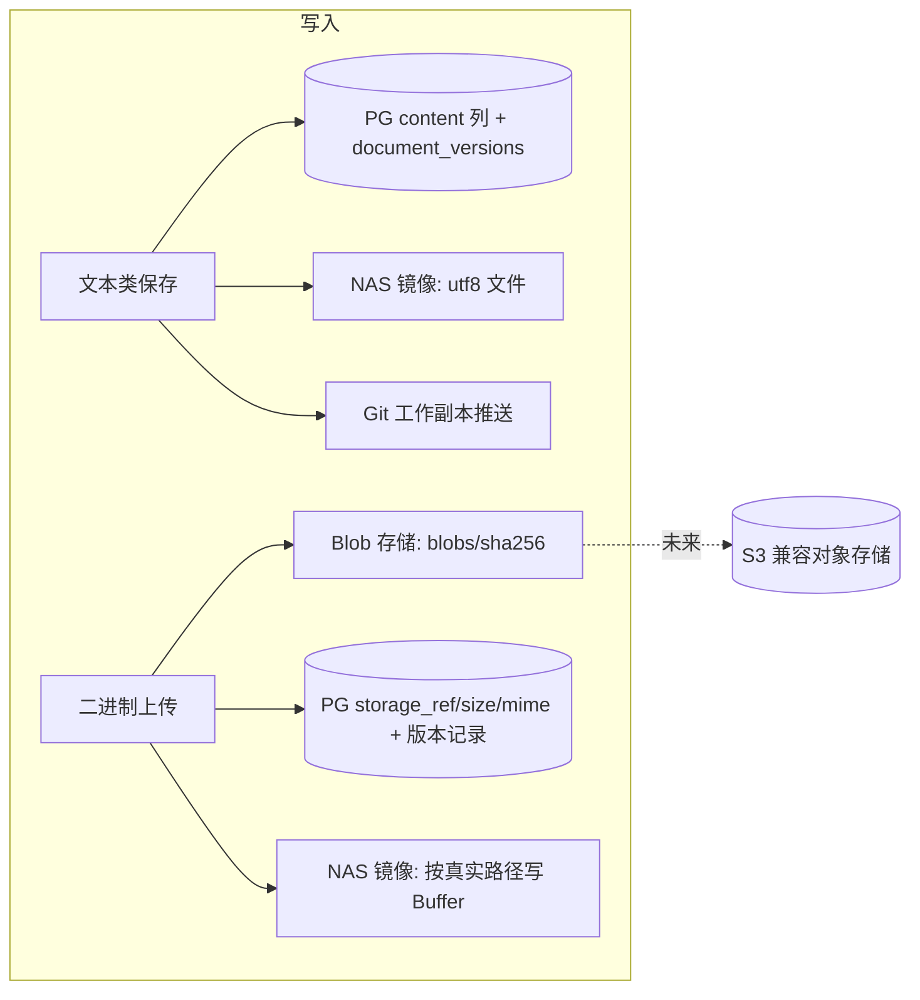
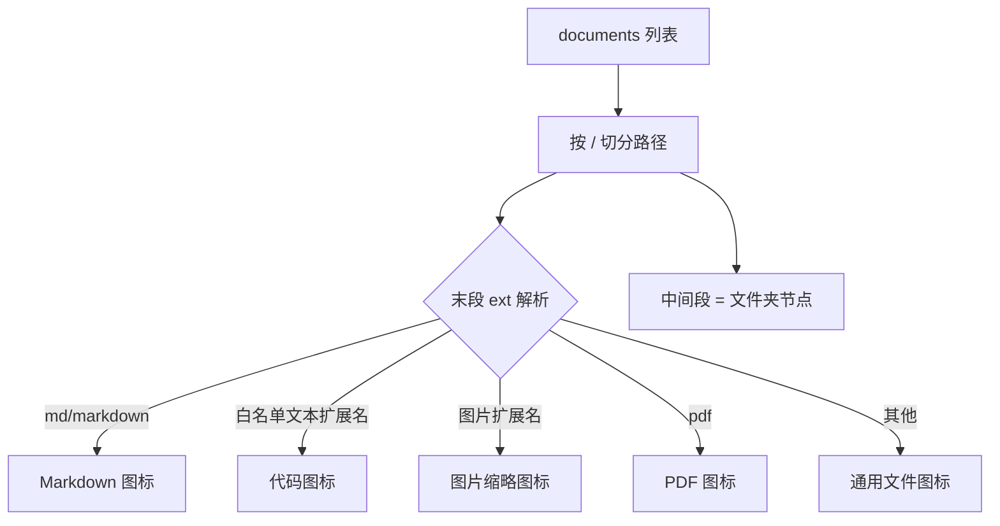
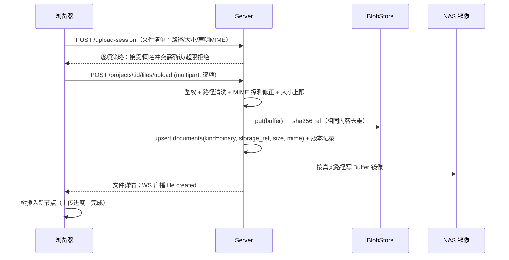
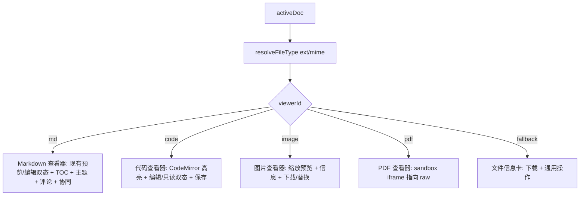

# 项目文档库通用文件管理重构设计

创建日期：2026-09-12
读者：前端、服务端、存储/发布工程

## 1. 背景与问题

当前项目文档库中，"文档"在数据、存储、界面三个层面都等价于"Git 仓库里的一个 `.md` 文本文件"。这个假设贯穿全链路：

- 服务端新建文档硬性校验 `path.endsWith('.md')`，改名同样要求 `.md` 结尾（[routes.ts#L1220](file:///d:/works/wiki-space/ewiki/apps/server/src/http/routes.ts#L1220)、[routes.ts#L1389](file:///d:/works/wiki-space/ewiki/apps/server/src/http/routes.ts#L1389)），路径规范化函数 `normalizeTreePath` 带 `requireMd` 开关（[routes.ts#L135-L154](file:///d:/works/wiki-space/ewiki/apps/server/src/http/routes.ts#L135-L154)）。
- `documents` 表只有文本列 `content text`，无 MIME、大小、存储位置等任何文件元数据；写入通道（NAS 镜像 `fs.writeFile(..., 'utf8')`、Git 推送 `PushChange.content: string`、导入 sink）全部只承载 UTF-8 字符串。
- 标题、摘要、字数按 Markdown 语法用正则推导（H1、代码块、图片/链接语法）；知识图谱只解析 Markdown 链接。
- 前端 4 处硬拼 `.md` 路径（新建文档、新建文件夹、两处重命名）；树节点不区分类型、图标固定 `FileText`、面包屑逐段显示原始路径；编辑器与 Markdown 预览内聚在 [BrowsePage.tsx](file:///d:/works/wiki-space/ewiki/apps/web/src/pages/BrowsePage.tsx) 的一个约 1900 行组件中。
- 系统没有任何上传、下载、二进制存取能力；S3 仅有配置占位，未接线。

随着项目空间被当作真正的资料库使用，用户需要把设计图、PDF 规范、JSON 配置、CSV 数据、示例代码等与 Markdown 文档放在同一棵目录树里统一组织、引用和检索。继续把文件类型锁死为 md，会逼着用户把二进制素材放到系统外、用外链拼 URL，资料与文档割裂。

## 2. 目标与范围

### 2.1 目标

1. 项目文档库从"Markdown 文档库"升级为"项目文件库"：一棵目录树同时容纳 Markdown、文本/代码、图片、PDF 及未来任意类型文件。
2. 打开文件时按类型获得对应体验：Markdown 保持现有编辑/预览/协同能力；代码文本类可在线编辑；图片与 PDF 可在线预览；其他类型显示文件信息卡并可下载、替换、移动、重命名、删除。
3. 类型能力以插件方式扩展：新增一种文件类型的查看器/编辑器不需要改动目录树、权限、版本、移动删除等公共链路。
4. 为远期"企业资产管理"留出存储与元数据空间（对象存储、任意 MIME、二进制版本），但一期只交付文本代码类、图片、PDF 三类的具体能力。
5. 历史数据零迁移成本：存量 md 文档行为与数据完全兼容，不需要停机刷库。

### 2.2 一期范围（2026 年 9 月迭代）

| 能力 | 一期交付 |
|---|---|
| 文件类型 | Markdown（md/markdown）、文本代码类（txt/json/yaml/yml/xml/csv/ts/js/tsx/jsx/py/java/go/rs/c/cpp/h/css/html/sql/shell/sh 等常见扩展名）、图片（png/jpg/jpeg/gif/webp/svg）、PDF；其他扩展名可上传，按"未知二进制"处理 |
| 目录树 | 真实文件名（含扩展名）显示、类型图标、类型筛选、按类型的新建/上传入口 |
| 文件操作 | 上传（单/多文件）、下载、在线预览（图片/PDF）、在线编辑（文本类）、重命名（含改扩展名）、移动、删除、替换上传 |
| 存储 | 文本入库入 Git 同现状；二进制入内容寻址 blob 存储（一期本地卷驱动，接口对齐 S3），NAS 目录中保留真实文件镜像 |
| 引用 | Markdown 中可用相对路径引用同库图片，预览与发布时正常显示 |
| 版本/历史 | 文本类沿用 PUT 乐观并发 + 版本快照；二进制保留每次上传的历史版本，可查看与下载旧版 |
| 评论、协同编辑、TOC、渲染主题、知识图谱 | 仅对 Markdown 生效；非 md 文件上这些入口隐藏或禁用 |

### 2.3 明确不做（远期）

- Office（docx/xlsx/pptt）、视频、音频、压缩包等在线预览/编辑——靠后续查看器插件接入。
- S3 驱动的生产接线——一期只有本地卷实现，但 blob 存储接口按 S3 语义设计。
- 真正的文件夹实体（数据库表）——文件夹仍是路径推导的虚拟节点。
- 二进制文件的多人实时协同（Y.Doc CRDT 通道是为 Markdown 文本建立的）。
- 全文检索二进制正文（PDF 抽词、图片 OCR）——一期搜索对非文本文件只匹配文件名/标题/标签。
- Git 仓库包含二进制文件（一期 Git 推送仅覆盖文本，见 7.3 的权衡说明）。

## 3. 核心概念模型

### 3.1 "文件"取代"文档"成为基础实体

`documents` 表的语义升级为"项目文件"。表名、接口前缀、URL 一期保持不变（避免大面积重命名），但其 `path` 不再受 `.md` 约束，新增类型与存储元数据列：

| 新增列 | 类型 | 说明 |
|---|---|---|
| `kind` | text not null default `'text'` | `text`（含 markdown）/ `binary`，决定内容通道与是否可在线编辑 |
| `mime` | text | MIME 类型，如 `image/png`、`application/pdf`；文本类为 `text/markdown`、`text/plain` 等 |
| `size` | bigint not null default 0 | 字节数 |
| `storage_ref` | text | 二进制当前版本的内容寻址引用（blob key）；文本类为 null，内容仍读 `content` 列 |
| `ext` | text | 小写扩展名（不含点），无扩展名为空串；列表/树渲染直接使用，避免每行字符串切分 |

历史行迁移：DDL 后执行一次回填——`ext` 由 `path` 推导（存量全部是 md），`kind='text'`，`mime='text/markdown'`，`size` 由 `length(content)` 回填，`storage_ref=null`。不改变任何 `path`，软删唯一约束 `(project_id, path)` 不受影响。

`document_versions` 增加 `storage_ref text` 与 `size bigint not null default 0`：文本版本照旧写 `content`，二进制版本 `content` 置空、正文落在 blob。

### 3.2 文件类型注册表（前后端共享单一事实源）

在 `@ewiki/shared` 新增文件类型注册表，前后端共同消费，杜绝各处自己写扩展名判断：

```ts
interface FileTypeDef {
  id: string;                              // 'markdown' | 'code' | 'image' | 'pdf' | 'binary'
  extensions: string[];                    // 小写、无点
  mime: string;                            // 缺省 MIME（上传时以客户端声明 + 服务端探测修正）
  kind: 'text' | 'binary';
  viewerId: string;                        // 前端查看器插件 id
  searchable: boolean;                     // 正文是否入全文搜索（一期仅文本）
}
```

内置注册：`markdown`（md/markdown，viewerId=`md`）、`code`（其余白名单文本扩展名，viewerId=`code`）、`image`（viewerId=`image`）、`pdf`（viewerId=`pdf`）、兜底 `binary`（viewerId=`fallback`）。

匹配顺序：先在前后端共享的纯函数 `resolveFileType(ext, mimeHint?)` 中按扩展名精确匹配，匹配不到时 binary kind 归 `binary`、文本 MIME 归 `code`。服务端以该函数作为路径校验与类型判定的唯一入口，取代 `requireMd` 正则。

### 3.3 存储双通道



Blob 存储一期落在 NAS 卷内的内容寻址目录 `<root>/blobs/<sha256 前2位>/<sha256 其余>`（或等价的 `blobs/<projectId>/<sha256>`，见 7.2）。同一字节内容全局只存一份，替换上传相同文件不产生新对象；删除文件后 blob 由后续 GC 任务回收（一期可只做不主动回收，依赖版本引用计数，避免误删旧版本）。

存储抽象放在 `@ewiki/storage`：定义 `BlobStore` 接口（`put(stream|buffer): Promise<ref>`、`get(ref): Readable`、`stat(ref)`、`delete(ref)`），一期实现 `LocalBlobStore`，预留 `S3BlobStore`（对应配置中已有的 `STORAGE_DRIVER`、`S3_ENDPOINT/BUCKET` 占位）。业务层不感知驱动。

### 3.4 文件名、标题与显示名

这是本次重构中需要显式纠正的一处概念混用：

- `path` 是真实文件路径（如 `design/登录流程-v2.png`），树、面包屑、Tab 一律显示其最后一段**完整文件名（含扩展名）**。
- `title` 是独立的显示标题字段，不随文件名强制联动。它用于 Markdown 正文 H1 推导、搜索结果副标题、卡片视图等场景；对二进制文件，`title` 缺省取不含扩展名的文件名，用户可单独修改而不改文件名。
- 因此上一迭代实现的"重命名标题同步改文件名"逻辑需要回退为解耦语义：Markdown 的"重命名"入口改文件名（含扩展名）；"标题"是元数据编辑。两个入口在文件信息面板中分别呈现，避免用户以为改标题会动文件路径。

## 4. 功能需求

### 4.1 功能总览

| # | 模块 | 功能说明 |
|---|---|---|
| F1 | 目录树 | 树节点按 `kind/ext` 显示类型图标（Markdown、代码、图片、PDF、通用文件、文件夹）；文件名完整显示含扩展名；支持按类型筛选（全部/文档/代码/图片/PDF/其他）；排序保持文件夹优先、同类按路径字典序 |
| F2 | 新建菜单 | 「+」下拉包含：新建 Markdown 文档（默认 `.md`）、新建文本文件（选择扩展名或直接输入完整文件名）、上传文件、上传文件夹；目标位置为当前选中文件夹或根 |
| F3 | 文件上传 | 系统文件选择器支持多选与文件夹选择；按目录结构在库内重建路径；同名文件弹出冲突选择（替换/两者共存自动加 `-1` 后缀/跳过）；上传中节点显示进度，失败可重试 |
| F4 | 类型分发查看 | 打开文件后由查看器注册表按文件类型分发：Markdown 查看器、代码查看器、图片查看器、PDF 查看器、兜底信息卡 |
| F5 | 代码文本编辑 | 代码/文本类用 CodeMirror 编辑：按扩展名语法高亮、UTF-8 文本、保存走与 Markdown 相同的 PUT 乐观并发与 WS 协同事件通道（一期不启用 CRDT，仅做保存时 409 冲突提示） |
| F6 | 图片预览 | 居中显示、等比缩放适配视口、点击放大查看原始尺寸、显示尺寸/大小信息；提供下载、替换上传、复制 Markdown 引用语法（``） |
| F7 | PDF 预览 | 浏览器内置 PDF 渲染（指向受鉴权保护的 raw 地址），工具栏提供下载、翻页由浏览器原生能力承担；一期不做自研批注 |
| F8 | 兜底文件卡 | 不支持预览的类型显示大图标、文件名、类型、大小、上传时间、上传者；主按钮下载，次级操作替换/重命名/移动/删除 |
| F9 | 重命名 | 右键/信息面板重命名修改完整文件名；扩展名可改，改扩展名时二次确认（类型与查看器会随之变化）；非法文件名字符（`/ \\ : * ? " < > |`）拦截；同目录名校验 409 |
| F10 | 移动与拖拽 | 现有移动对话框与文件夹拖拽对任意类型生效；移动二进制文件时同步更新 NAS 镜像路径与 blob 引用不变（内容寻址）；移动文件夹级联规则沿用路径前缀 |
| F11 | 删除 | 单文件删除沿用软删与活动留痕；二进制文件删除后 raw 链接立即失效（blob 因旧版本保留暂不物理删除）；文件夹删除级联所有类型子项 |
| F12 | 下载 | 所有文件提供下载；文件名使用真实 basename；下载走带鉴权的 raw 接口并附 `Content-Disposition` |
| F13 | 文件信息面板 | 右侧抽屉/属性区显示：类型、大小、MIME、存储位置（文本库/对象存储）、路径、创建/更新时间与人员、当前版本；Markdown 额外提供标题元数据编辑 |
| F14 | 版本历史 | 文本类沿用现有版本列表与 diff；二进制类版本列表每次替换上传产生一条，记录大小/上传者/时间，可下载任意旧版，一期不做二进制内容 diff |
| F15 | 搜索 | 搜索结果包含全部类型，结果行显示类型图标；文本类匹配正文（现状 ilike 保持），非文本类一期仅匹配文件名与标签；结果支持按类型 facet 过滤 |
| F16 | Markdown 引用图片 | Markdown 编辑器插入图片时可从库内选择文件，写入相对路径；预览与发布渲染时把相对路径解析为受鉴权 raw 地址（编辑态）或站点产物地址（发布态） |
| F17 | 发布 | 发布任务把被 Markdown 引用到的图片/二进制从 blob 复制进站点产物目录，站点静态服务已有 MIME 表需扩充（png/jpg/jpeg/gif/webp/svg/pdf 等）；未被引用的库文件不进发布产物 |
| F18 | 导入导出 | 现有"本地文件夹递归导入"放开 md 白名单：文本类按文本入库，二进制按上传通道入 blob；一期不实现整库导出（沿用缺口现状） |

### 4.2 目录树与新建交互

树构建函数 `buildTree` 目前把每个 path 末段无条件当作文档。改造后节点携带 `kind/ext/mime`，图标由注册表解析：



新建 Markdown 文档的路径拼接从 `${slug}.md` 变为按所选类型生成：新建 Markdown 默认补 `.md`；新建文本文件要求文件名必须带扩展名（未带时按选择的类型补默认扩展名）；上传完全保留用户原始文件名（经服务端文件名字符清洗，见 5.1）。一期不引入文件夹实体，新建文件夹仍通过在该路径下创建一个占位文件使其在树中出现：占位文件固定命名为 `.keep`（kind=text、空内容），树中以弱化样式显示且不出现在默认搜索结果中；当文件夹内出现其他文件后，用户可手动删除该占位文件。

面包屑改为显示 basename 完整名；点击父级文件夹段跳转该文件夹筛选视图（沿用现有 folder query 语义）。

### 4.3 上传流程与异常



边界与异常规则：

- 单文件大小上限默认 100MB（服务端配置项 `UPLOAD_MAX_BYTES`）；超限在上传会话阶段直接拒绝，前端选择器后即提示。
- 允许零字节文件（占位、空 CSV 等场景真实存在），按正常二进制/空文本处理。
- 同名冲突三选一的结果必须在同一批次内一致：选择"替换"时若目标文件类型不同（如 `a.md` 换成 `a.png` 但扩展名没变的情况实际不存在，真正冲突场景是路径完全相同），按新内容覆盖并产生新版本，`kind/mime` 以新文件为准。
- 上传中断：前端以单文件为粒度标记失败可重试；服务端未完成的 multipart 不落库、不写镜像。
- 安全：上传目录穿越校验复用 `safeJoin`；禁止保留 `.git`、`.well-known` 等特殊路径段；SVG 一期按 `text` 类入库但预览时按 `image/svg+xml` 以沙箱 iframe/强制 `Content-Security-Policy: sandbox` 渲染，禁止内联脚本执行（防存储型 XSS）；raw 接口对 HTML/SVG 默认 `Content-Disposition: attachment` 或 sandbox 头。
- 服务端不信任客户端 MIME：用扩展名表 + 文件头魔数探测（图片/PDF 均有明确魔数），两者不一致时以魔数为准并记录。

### 4.4 查看器分发与编辑规则

打开文件后，中间区域不再直接是 Markdown 编辑器，而是一个文件宿主组件：



各查看器统一实现插件接口（见第 6 章）。公共头部（面包屑、保存状态、操作菜单、评论/历史入口）由宿主提供，查看器只负责内容区。Markdown 现有能力（双击编辑、Ctrl+S、Ctrl+E、ESC、WS 脏缓冲处理、渲染主题、TOC scroll-spy）整体迁移进 md 查看器插件，行为不变。

代码查看器一期规则：编码仅支持 UTF-8（保存时检测非法 UTF-8 则拒绝并提示）；超过 2MB 的文本文件降级为只读并提示下载（避免 CodeMirror 卡顿）；保存按钮、未保存提示、离开拦截与 Markdown 编辑态一致；不提供 Markdown 快捷键面板。

图片/PDF/兜底类型没有"编辑内容"概念，头部不显示编辑切换；替换上传承担"修改"。

### 4.5 重命名、标题与移动的语义

| 操作 | 修改字段 | 是否改 path | 适用类型 |
|---|---|---|---|
| 重命名文件 | path 的 basename（含扩展名） | 是 | 全部 |
| 编辑标题 | title | 否 | 全部（Markdown 标题影响 H1 兜底展示） |
| 移动 | path 的目录部分 | 是 | 全部 |
| 替换上传 | content/storage_ref + size/mime + 新版本 | 否 | 全部（文本类也允许整文件替换） |

改扩展名的二次确认文案明确写出"文件将按新类型打开，原查看器能力（如 Markdown 预览/评论入口）可能消失"。重命名冲突、非法字符、文件夹级联等规则与现有 PATCH 链路一致，服务端把 `requireMd` 换成注册表校验：扩展名必须非空且合法（允许无扩展名文本文件存在，但新建入口默认带扩展名）。

## 5. 服务端设计

### 5.1 路径与类型校验

`normalizeTreePath` 改造：

- 移除 `requireMd`，改为 `accept: (ext) => FileTypeDef` 校验：路径非空、无前后斜杠、无 `..`、无 Windows 非法字符、无空路径段；basename 不允许只有 `.`/空格结尾。
- 保留中文名、点号（多扩展名如 `tar.gz` 按最后一个点取 ext）、连字符。
- 新建与 PATCH 共用该校验；冲突仍返回 409 `DOCUMENT_EXISTS`。

### 5.2 接口清单（在现有前缀上扩展）

| 方法与路径 | 说明 | 关键规则 |
|---|---|---|
| `POST /projects/:id/documents` | 新建文本文件 | 放开 `.md` 限制；body 增加 `mime?`；按注册表推导 kind/ext；markdown 无 title 时继续用 H1 兜底，其他文本 title 缺省取无扩展名 basename |
| `POST /projects/:id/files/upload-session` | 上传预检 | 入参文件清单（path/size/mime），返回逐项 `accept/conflict/reject` 与原因；用于批量冲突确认与前置超限拦截 |
| `POST /projects/:id/files/upload` | 单文件上传 | `multipart/form-data`（Hono `parseBody`，限制 `UPLOAD_MAX_BYTES`）；落 blob + 落库 + NAS Buffer 镜像 + WS 广播；幂等键支持重试 |
| `GET /documents/:id/raw` | 原始内容下载/预览 | 文本类从 content 返回 UTF-8；二进制从 blob 流式返回；按 mime 设置 `Content-Type`，SVG/HTML 等活动内容类型附加 sandbox 策略，下载意图走 `?download=1` 附 `Content-Disposition` |
| `PUT /documents/:id/content` | 文本保存 | 即现有 PUT 正文接口，增加 kind=text 校验（二进制调此接口返回 409 `BINARY_USE_UPLOAD`）；`baseVersionNo` 乐观并发不变 |
| `POST /documents/:id/versions/upload` | 二进制替换上传 | multipart；产生新版本并更新当前 storage_ref/size/mime；旧版本保留 |
| `PATCH /documents/:id` | 元数据/改名/移动 | path 校验换成注册表；path 变更允许扩展名变化；`kind/mime` 在内容替换时由服务端重算，不由 PATCH 直接改 |
| `GET /documents`（列表） | 列表 | 返回增加 `kind/ext/mime/size`；树渲染不再依赖扩展名现场切分 |
| `GET /documents/:id` | 详情 | 文本类返回 `content`；二进制不内联内容，返回 `storageRef` 与 raw 地址（签名 token 或直接带会话，见 5.4） |
| 现有移动/删除/文件夹接口 | 不变 | 前缀级联与软删逻辑天然类型无关，仅需在镜像层支持 Buffer |

### 5.3 NAS 镜像与 Git 推送的改造

- `mirrorDoc` 签名从 `content: string | null` 扩展为 `payload: { kind: 'text'; content: string } | { kind: 'binary'; buffer: Buffer } | null`；写盘按类型选择编码，删除分支不变；新增 `mirrorBlob` 无必要——二进制镜像直接写真实路径（NAS 镜像本来就是给用户在文件系统侧看到与库一致的结构）。
- 移动/重命名 `moveMirror` 基于 `fs.rename`，天然类型无关，无需改动。
- 平台对接层 `DocStorageOp` 与 `PushChange` 扩展二进制语义。一期取舍（在 7.3 详述）：Git 推送仅包含文本类变更；二进制变更只写 NAS 镜像与 blob，不入 Git 工作副本。`docStorageEffects` 按 kind 分流，返回结果中区分 `git` 与 `mirror` 两个成功标志，活动流文案对上传使用"上传文件"而非"同步提交"。

### 5.4 鉴权与 raw 地址

raw 接口必须带项目读权限校验（复用 `projectAccess`），不能做成公开链接。编辑态预览图片/PDF 使用 `/api/v1/documents/:id/raw`，浏览器标签直接打开时依赖现有 Bearer 机制——Bearer 存在 localStorage 无法天然用于 ``，因此一期为 raw 增加短期签名查询参数：详情接口下发 `rawUrl`（含 HMAC 签名 + 过期时间，默认 30 分钟，沿用服务端密钥体系），``/iframe 直接使用；`apiFetch` 调用场景仍走 Authorization 头。签名只授权单文件只读，不带任何写权限。

### 5.5 摘要、标题、字数与链接图谱

- `documentSummary`：仅对 markdown 跑现有 Markdown 正则；code 文本类做截断式纯文本摘要（去符号、取前 120 字）；二进制摘要为空。
- `wordCount`：文本类维持字母数字计数；二进制为 0，列表展示改用 `size` 人类可读值。
- `links.ts`：链接抽取只对 markdown 文件执行（现状是全量文档都跑，改造后按 kind/ext 过滤输入）；相对路径解析的候选顺序调整为先精确匹配真实路径，再回退 `${p}.md` 与去 `.md` 候选，兼容历史写法。图片语法解析出的目标若命库内文件，建立 `documentLinks` 关系并在删除被引用图片时于活动流给出提示（一期不阻止删除）。
- 搜索适配器 `SearchDocument` 增加 `kind/ext`；非文本不参与 content ilike（查询加 `where kind='text' OR ...` 的文件名/标签分支）。
- AI 分类：输入已是 `{id, path, title}`，天然兼容；建议结果仅写 folder/tags，不触碰类型。

## 6. 前端插件化架构

### 6.1 查看器插件接口

新建 `apps/web/src/fileview/` 模块，定义类型注册表在前端的消费方式与插件契约：

```ts
interface FileViewerPlugin {
  id: string;                              // 'md' | 'code' | 'image' | 'pdf' | 'fallback'
  displayName: string;
  accepts: (file: FileMeta) => boolean;    // 通常由注册表 viewerId 映射，插件可自定义判定
  capabilities: {
    editable: boolean;
    downloadable: boolean;
    replaceable: boolean;
    showToc: boolean;
    showComments: boolean;
    showVersions: boolean;
  };
  component: ComponentType<FileViewerProps>;
}

interface FileViewerProps {
  file: DocumentDetail;                    // 含 kind/ext/mime/size/rawUrl
  canWrite: boolean;
  isDark: boolean;
  onSave?: (content: string) => Promise<void>;
  onReplaced: () => void;                  // 替换上传后刷新宿主
  host: { openInfo(): void; openHistory(): void };
}
```

插件在一个注册数组中登记，宿主按 `resolveFileType(ext, mime).viewerId` 选插件，找不到时 `fallback` 兜底。后续新增 Office 查看器只需：在 shared 注册类型、写一个插件组件、登记进数组——目录树、上传、raw、版本、权限链路零改动。

### 6.2 页面组件拆分

当前 `BrowsePage.tsx` 约 1900 行，内聚了数据层、树、菜单、弹窗、Markdown 编辑器。本次重构的目录建议：

```
src/fileview/
  registry.ts              前端查看器注册与类型图标映射
  types.ts                 FileViewerPlugin / FileViewerProps / FileMeta
  FileHost.tsx             文件宿主：公共头部、分发、保存状态、WS 订阅桥接
  plugins/MarkdownViewer.tsx   从 BrowsePage 迁出预览/编辑双态、TOC、主题、快捷键
  plugins/CodeViewer.tsx
  plugins/ImageViewer.tsx
  plugins/PdfViewer.tsx
  plugins/FallbackViewer.tsx
  FileInfoDrawer.tsx       文件信息面板（F13）
  VersionPanel.tsx         版本面板（文本 diff 与二进制下载两种形态）
src/tree/
  buildTree.ts             纯函数：list -> 带类型的树
  fileIcons.tsx            ext/kind -> lucide 图标
  UploadManager.tsx        上传会话、进度、冲突弹窗
```

BrowsePage 保留数据查询/变更、路由状态、树与弹窗编排，编辑区渲染 `<FileHost file={activeDoc} />`。该拆分会顺带消除现有页面中 Markdown 专属状态（editContent/view/renderTheme）对非 md 文件的无效传递。

### 6.3 上传与下载的前端实现

- 上传：`<input type="file" multiple>` 与 `webkitdirectory` 文件夹选择；前端先计算相对路径与大小调用 upload-session，冲突弹窗收集决策后逐文件 `FormData` POST；树节点插入 uploading 占位行显示进度（XHR 进度条，fetch 不易取上传进度）；成功后以 WS `file.created` 或接口返回为准去重插入。
- `apiFetch` 当前对有 body 请求默认加 `application/json`，上传调用需绕过默认头（FormData 让浏览器自行设置 boundary），在 client 增加一个显式 `apiFetchForm` 或允许调用方覆盖 Content-Type。
- 下载：`window.location = rawUrl`（签名地址）或用 fetch 取 blob 触发另存；一期直接用签名 raw 地址加 `?download=1`。
- Markdown 编辑器"插入图片"增强为文件选择器（库内选择 + 本地上传后插入），产物仍是标准 Markdown 相对路径，不引入私有语法。

## 7. 数据迁移、配置与权衡

### 7.1 迁移步骤

迁移脚本放在现有迁移机制中（与 schema 同目录的版本化 SQL/任务）：

1. `documents` 增加 `kind/mime/size/storage_ref/ext` 列，均带默认值或可空，不锁表（PG 加带常量默认列不重写）。
2. 回填：`UPDATE documents SET ext='md', kind='text', mime='text/markdown'`（存量全部 md；path 已是 md）；`size` 用 `octet_length(content)` 回填。
3. `document_versions` 增加 `storage_ref/size`，历史行 size 同样回填，storage_ref 留空。
4. 部署新服务端代码：`requireMd` 校验移除后，旧前端仍只发 `.md` 路径，新旧前后端可短暂共存；新前端发布后即开放非 md 入口。
5. NAS 现存镜像无需变动（都是 md 文本）。

回滚策略：新增列对旧代码无害（旧代码忽略未知列）；已上传的二进制行在回滚后会出现在旧树中且无法打开，因此回滚预案是回滚代码并保留列，由管理员在文件系统侧处理新增二进制，不做自动删除。

### 7.2 配置项

| 配置 | 默认 | 说明 |
|---|---|---|
| `UPLOAD_MAX_BYTES` | 104857600 | 单文件上限，upload-session 与 parseBody 同时生效 |
| `BLOB_DRIVER` | `local` | `local`（一期）/ `s3`（接口预留） |
| `BLOB_LOCAL_ROOT` | `<FS_NAS_ROOT>/blobs` | 本地 blob 根，独立于用户镜像目录便于整体挂载/迁移 |
| `S3_*` | 现有占位 | S3 驱动接线时使用 |
| `RAW_URL_TTL_SECONDS` | 1800 | raw 签名链接有效期 |

### 7.3 关键权衡：二进制一期不入 Git

已确认的存储方向是"对象存储 + 仓库引用"。一期 Git 工作副本与 Gitea 推送只覆盖文本，原因：

- 现状 Git 链路（`PushChange`、工作副本、NAS 镜像）全部按 UTF-8 字符串构造，让二进制进 Git 需要扩展推送协议、在镜像侧保留二进制、处理平台库 clone 出来的二进制与 blob 的一致性，工作量与一期价值不匹配。
- 用户可见的文件系统镜像（NAS）中二进制文件真实存在、可直接浏览取用，"资料集中存放"的核心诉求不受影响；受影响的只是"直接 clone Gitea 仓库得到全量资料"这一用法。
- 版本化由 PG 版本表 + blob 内容寻址提供，不依赖 Git 历史。

后续若要让二进制也进 Git，升级路径明确：推送时从 blob 取 Buffer 写入工作副本，`PushChange` 增加二进制变体；因为 blob 已内容去重，推送成本主要是工作副本磁盘占用。

### 7.4 风险与对策

| 风险 | 等级 | 对策 |
|---|---|---|
| 大文件 multipart 一次性进内存造成服务端压力 | 中 | 一期上限 100MB 且 Hono 解析落临时文件；`BlobStore.put` 接收文件路径/流而非全量 Buffer；远期接 S3 multipart |
| 活动内容类型（SVG/HTML）存储型 XSS | 高 | raw 响应 sandbox CSP、图片查看器中 SVG 用 sandbox iframe；上传魔数校验；下载强制 attachment |
| raw 签名 URL 被转发外泄 | 中 | 30 分钟过期、HMAC 绑定文件 id 与用户、只授予只读；服务端记录 raw 访问审计（一期可只在活动流留痕） |
| 非 md 误用 Markdown 能力（评论锚点、图谱、TOC） | 低 | 能力由插件 `capabilities` 声明，宿主按能力隐藏入口，不允许页面自行判断扩展名 |
| 改扩展名导致类型与查看器跳变 | 中 | 二次确认；服务端以新扩展名重算 kind/mime；内容不匹配（如把 PNG 改名 .md）由编辑器展示乱码，保存侧对文本做 UTF-8 校验拦截 |
| 存量 md 文档行为回归 | 中 | 迁移不改 path；链接解析保留 `.md` 回退候选；md 查看器由现有代码平移而非重写，逐快捷键/WS 场景回归 |
| blob 垃圾累积 | 低 | 内容寻址 + 引用计数；一期不物理回收，提供统计视图，后续加 GC 任务 |
| 同名软删行占位导致上传冲突 | 低 | 沿用现有软删唯一约束处理策略；上传冲突检测与新建保持同一套查询（含 deletedAt 语义） |

## 8. 分期计划与验收

### 8.1 分期

| 阶段 | 内容 |
|---|---|
| P0 地基 | db 迁移（新列与回填）；shared 文件类型注册表 + `resolveFileType`；路径校验去 md 化；列表/详情接口返回类型字段；前端树类型图标与真实文件名显示；标题/文件名解耦（回退标题联动改名） |
| P1 文本类 | 代码查看器（CodeMirror 高亮/保存/冲突/大小降级）；新建文本文件入口；信息面板；非文本搜索类型 facet |
| P2 二进制链路 | BlobStore 本地实现 + 配置；upload-session/upload/替换上传/raw 签名下载；NAS Buffer 镜像；图片查看器、PDF 查看器、兜底文件卡；上传 UI 与冲突/进度 |
| P3 引用与发布 | Markdown 库内选图插入；预览相对路径解析；发布产物复制二进制并扩充 MIME；文件夹导入放开白名单；版本面板二进制形态 |
| P4 远期 | S3BlobStore 接线；二进制入 Git 推送；Office/视频等查看器插件；PDF 抽词/OCR 搜索；二进制协同；整库导出 |

P0 独立交付即可解决"文件名扩展名显示、标题与文件名混用"两个当前可见问题，且不引入二进制复杂度。

### 8.2 验收标准（P0–P3）

1. 存量库中所有 md 文档树、面包屑显示完整文件名 `xxx.md`；打开、编辑、预览、保存、评论、历史、图谱、发布行为与改造前一致，WS 协同场景无回归。
2. 修改 Markdown 标题不再改动文件 path；重命名必须显式修改文件名；改名时改扩展名有确认提示，改后按新类型打开。
3. 新建代码/文本文件（至少覆盖 json、txt、ts、csv 四种）可在线编辑、保存产生版本、冲突时出现 409 提示；2MB 以上文本自动降级只读并可下载。
4. 上传 PNG、JPG、PDF、以及一个不支持类型（如 docx）各一个：树中图标正确、信息面板显示大小/MIME/路径；图片可预览并复制出可用的 Markdown 相对引用；PDF 在 sandbox 中打开；docx 显示信息卡并可下载。
5. 同名上传给出替换/共存/跳过三个选择且行为符合选择；超过大小上限的文件在选择后即被拒绝；上传中断后单文件可重试且不产生半成品记录。
6. 上传 100 个小文件（含文件夹结构）后目录层级在树与 NAS 镜像目录中一致；移动/删除文件夹对二进制文件同级联生效。
7. 在 Markdown 中相对路径引用一张库内图片：编辑预览可见；发布后站点中图片可访问；删除该图片后活动流出现引用提示。
8. 直接用无权限账号访问 raw 签名地址被拒；过期签名地址返回 401；SVG 文件响应带 sandbox 策略且其中脚本不执行。
9. blob 存储路径为内容寻址：同一图片重复上传两次，blob 物理对象只有一份，两个文件/版本均可正常访问。
10. 搜索"设计"能同时命中 md 文档、名为"设计.png"的图片与带标签的 PDF，结果行类型图标正确。

## 附：现有代码改造点索引

| 层 | 文件 | 改造点 |
|---|---|---|
| 路径校验 | [routes.ts](file:///d:/works/wiki-space/ewiki/apps/server/src/http/routes.ts) L135-154、L1220、L1389 | `requireMd` 换注册表校验 |
| 元数据推导 | routes.ts L118-129、L451、L1236-1239 | 摘要/标题/字数按 kind 分流 |
| 镜像 | [nas.ts](file:///d:/works/wiki-space/ewiki/apps/server/src/lib/nas.ts) L43-52 | mirrorDoc 支持 Buffer |
| 平台推送 | [routes-platform.ts](file:///d:/works/wiki-space/ewiki/apps/server/src/http/routes-platform.ts) L101-115、L179-188 | 存储 op 类型分流，一期二进制跳过 Git |
| 数据模型 | [schema.ts](file:///d:/works/wiki-space/ewiki/packages/db/src/schema.ts) L133-168 | documents/versions 新列 |
| 链接 | [links.ts](file:///d:/works/wiki-space/ewiki/packages/shared/src/links.ts) L30-77 | 仅 md 抽取、路径精确优先匹配 |
| 搜索 | [search.ts](file:///d:/works/wiki-space/ewiki/apps/server/src/adapters/pg/search.ts) L21-46 | 类型 facet、非文本仅名/标签 |
| 存储 | [index.ts](file:///d:/works/wiki-space/ewiki/packages/storage/src/index.ts) | BlobStore 抽象与本地实现 |
| 发布 | routes.ts L2149-2200、routes-platform.ts L45-60 | 产物复制二进制、MIME 扩充 |
| 种子/模板 | library-templates.ts、routes-starter.ts、seed.ts | 内容保持 md 即可，不需为多类型改造（注册表已能容纳） |
| 前端树 | [BrowsePage.tsx](file:///d:/works/wiki-space/ewiki/apps/web/src/pages/BrowsePage.tsx) L208-222、L350/L498/L595、L846-861 | 类型树、图标、面包屑 |
| 前端路径拼接 | BrowsePage.tsx L1422-1452、L1497-1519、L1637-1655 | 去 `.md` 硬拼，标题/文件名解耦 |
| 前端编辑区 | BrowsePage.tsx L697-1120 | 迁出为 fileview 插件结构 |
| API client | [client.ts](file:///d:/works/wiki-space/ewiki/apps/web/src/lib/api/client.ts) L84-116 | 支持 FormData/raw 下载 |
