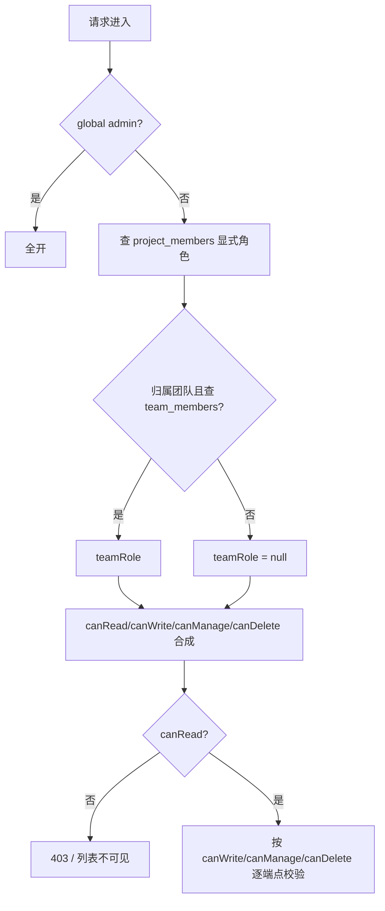

# 团队 · 文档归属 · 分级权限 · 设计与落地规划

> 状态：**已实施并通过验收，B0 + B1 + B2 全部落地（2026-09-14）**，见 §12 实施记录。
> 关联：`docs/PRD.md`（F35 发布）、`docs/DESIGN.md`（§3.2 数据模型）、`specs/EXT-PLATFORM-PLAN.md`（通知链路 ADR-P3）、`apps/server/scripts/e2e-platform.mjs`（验收基线 P7–P9）
> 证据约定：文中所有现状结论均以 `file:line` 标注，已逐行核实。范围：ewiki（apps/server + apps/web + packages/db + packages/shared）。

---

## 0. 结论（TL;DR）

用户提出的三个缺陷，根因与方案一句话对照：

| # | 缺陷 | 根因（现状证据） | 方案 |
|---|---|---|---|
| 1 | 用户无法创建团队 | 平台根本没有团队实体：`/api/v1/team` 是把**全平台用户表**映射成假角色的列表页（`routes.ts:865-895`），"邀请"实为凭空创建平台账号（`routes.ts:900-941`），"改角色"实为改 `users.global_role`（`routes.ts:945-971`） | 新增 `teams` + `team_members`（类 GitLab Group）；任何登录用户可建团队；`/api/v1/team*` 三端点下线，能力收敛到 `/api/v1/admin/users*` 与新的 `/api/v1/teams*` |
| 2 | 用户无法决定文档归属 | `projects.ownerId` 恒为创建者（`schema.ts:77-79`），创建/修改均无归属选择 | `projects.owner_type ∈ {user, team}` + `owner_team_id`；建库时选归属；库设置页支持「个人 ⇄ 团队」转移（新端点 + 审计） |
| 3 | 可见性三态失控 | 服务端 `team` 与 `public` **语义完全等价**（都是"任何已登录用户可读"，`permissions.ts:41`）；写权限恒需逐库 `project_members` 成员；且同一个枚举在 4 处 UI 文案互相矛盾（§1.3 表） | 五态化：`private / team-read / team-write / public-read / public-write`；"范围"（谁能进来）与"能力"（谁能写）解耦；权限解析统一为单函数，3 处手写 SQL 收敛为同一口径 |

**五条核心决策**（详见 §3.3 ADR-T1~T5）：

1. **可见性单字段五态**，不用"scope × level"双字段——CHECK 简单、前端单选择器、迁移一条 UPDATE。
2. **有效权限 = 显式成员角色 ∪ 团队隐式档位**（取并集/max 语义，与 GitLab 一致）；显式 `guest` 是"最低保障"而非"上限限制"。
3. **团队角色只管组织层**（成员管理、团队设置、团队库治理），**不直接决定库内读写**——库内读写由可见性档位 + 显式角色决定；避免"团队 role ⇒ 全部库角色"的隐式放大。
4. **存量迁移取等价原则**：旧 `team` → 新 `public-read`（因为旧 team 的真实语义就是全平台登录读），旧 `public` → `public-read`；新档位 `team-*` 不自动授予任何存量库。
5. **本期不做匿名读**（保持"全档位登录态"）；匿名访问面维持现状 = 已发布站点 `/sites/:slug`（`routes-platform.ts:917-918`）与 `/api/v1/open/*`。

**附带发现（P0 越权漏洞，须先行止血，见 §1.2）**：`POST /api/v1/team/invite`（任何人可造账号）与 `PATCH /api/v1/team/:id/role`（**任何人可把自己提权为 admin**）两个端点无任何权限校验。

---

## 1. 现状盘点（2026-09-14 逐行核实）

### 1.1 数据模型：团队实体缺失

| 事实 | 证据 |
|---|---|
| 无 `teams` / `team_members` 表；唯一的成员关系是**逐库**邀请 | `packages/db/src/schema.ts:98-114`（`project_members`，role=owner\|maintainer\|editor\|guest，`unique(project_id,user_id)`） |
| 库归属只有 `ownerId`（用户），无 team 维度 | `schema.ts:77-79`（`owner_id NOT NULL → users.id`） |
| 可见性只有三态 | `schema.ts:63`（`// private | team | public`）+ `packages/shared/src/schemas/index.ts:4`（`Visibility = z.enum(['private','team','public'])`） |
| 建库入口不接受归属参数 | `packages/shared/src/schemas/index.ts:62`（`CreateProjectSchema.visibility`，无 owner 字段） |
| 建库恒把创建者写成库 owner | `apps/server/src/http/routes.ts:479,501`（`visibility: body.visibility ?? 'private'`；插入 `projectMembers{role:'owner'}`） |

### 1.2 附带发现：两个 P0 越权漏洞（本机实测口径）

| # | 端点 | 现状（证据） | 危害 |
|---|---|---|---|
| S1 | `PATCH /api/v1/team/:id/role` | 无任何权限校验（`routes.ts:945-971`）；且逻辑为 `role==='Owner' → globalRole='admin'`（`routes.ts:960`），仅阻止"自降级"（`routes.ts:955`），**不阻止自升级** | **任何登录用户可把自己提为全局 admin**（对照：管理端同类端点有 `requireAdmin` 守卫，`routes-platform.ts:640,700-714`） |
| S2 | `POST /api/v1/team/invite` | 无权限校验（`routes.ts:900-941`），可直接 `INSERT users`（status='invited'） | 任意用户可批量造账号、污染审计与成员目录 |
| S3 | `GET /api/v1/team` | 无权限校验，返回全平台用户（`limit(200)`，含 email/globalRole） | 全量用户枚举；且与"团队"语义完全不符（见缺陷 1） |

### 1.3 可见性口径漂移（同一枚举，六处口径互不一致）

| 来源 | "私有" | "团队" | "公开" |
|---|---|---|---|
| 服务端真实语义 | 仅 `project_members` 成员可读 | **全平台登录可读**（`permissions.ts:41`；列表过滤 `routes.ts:353,990`；动态流 `routes.ts:782`） | **与 team 完全相同**（`permissions.ts:41`） |
| 写权限 | 逐库成员 role ∈ {owner,maintainer,editor}（`permissions.ts:12,42`） | 同左（`team` 只给读，不给写） | 同左 |
| 建库页文案 | "私有（仅成员可见）"（`NewProjectPage.tsx:116`） | "团队（登录用户可读）"（`:117`） | "公开（登录用户可读写入口可见）"（`:118`，**写入口实际不可用**） |
| 库设置页文案 | "私有：仅成员可见"（`ProjectSettingsPage.tsx:75`） | "团队：企业内可发现"（`:76`，**与后端不符**） | "公开：任何人可查看"（`:77`，**与后端不符**：仍需登录） |
| 库列表标签 | `Lock 私有`（`LibraryPage.tsx:91`） | `Users 团队`（`:92`） | `Globe 公开`（`:93`） |
| 仪表盘标签 | `私有`（`DashboardPage.tsx:264`） | `团队` | `公开` |

**结论：`team` 这个枚举值的宣称语义（"团队可见"）与实现语义（"全员登录可见"）之间没有任何代码在支撑，这正是"权限容易失控"的根因**——用户以为收敛到了团队，实际是全站。

### 1.4 其他相关事实（影响设计）

| 事实 | 证据 | 设计含义 |
|---|---|---|
| 全站唯一登录闸门：除 `/auth`、`/open/*` 外一律要 Bearer | `routes.ts:313-318` | 五态全部落在登录态内，不改 auth 模型；匿名读不在本期 |
| 项目列表过滤是手写 SQL（团队条件将来要 join） | `routes.ts:353`；同款 SQL 共 3 处：`routes.ts:353/782/990` | 必须抽单一口径构造器，否则三处必然漂移 |
| 3 处 SQL 现状均写 `visibility <> 'private'` | 同上 | 五态化后此条件不再正确，须整体替换 |
| 前端角色判定按 `myRole` 推导，加载中/失败按 owner 放开 UI | `use-project-role.ts:47`；后端 403 兜底 | 五态后需下发 `teamRole/effectiveRole`，避免"继承权限"在 UI 上不可见 |
| 库成员端点已下发 `myRole`/`visibility` | `routes.ts:2131-2164` | 扩展响应即可，前端改动可控 |
| 管理端已有完整用户管理（含角色） | `routes-platform.ts:643,661,700` | S1/S2 的"造账号/改角色"能力已有正确归属地，无需新建 |
| e2e 基线 P7（分享协作）/ P9b-e（用户管理）已覆盖既有矩阵 | `scripts/e2e-platform.mjs:445-556` | 新用例续编 P10 段，复用既有账号与 `record()` 断言风格 |
| 迁移目录已用到 0006 | `apps/server/drizzle/0000~0006_*.sql` | 新迁移编号 **0007** |

---

## 2. 目标与非目标

**目标（本期）**

1. 任何登录用户可创建团队（类 GitLab Group），管理成员与角色；团队即可作为文档库的**归属主体**。
2. 建库时用户可选择归属：个人 / 本人所在团队。
3. 可见性五态落地：`private / team-read / team-write / public-read / public-write`；个人库禁用 `team-*`；`team-*` 必须归属团队（DB CHECK 兜底）。
4. 归属可转移（个人 → 团队；团队 → 个人），全链路审计。
5. 后端 3 处手写过滤 SQL 收敛为单一构造器；权限矩阵 200 组合单测覆盖；e2e P10 段端到端验收。

**非目标（本期不做，列入 §11 开放问题）**

- 匿名读（未登录访问 `public-*` 库）；团队嵌套/子团队（Subgroup）；团队级 Git 命名空间绑定（storage connection 共享）；"申请加入团队"流程；团队公开主页/发现目录；`public-write` 的限流与滥用治理。

---

## 3. 领域模型

### 3.1 新表（`packages/db/src/schema.ts`）

```ts
// ---- 团队（类 GitLab Group，不含嵌套子团队） ----
export const teams = pgTable('teams', {
  id: uuid('id').primaryKey().defaultRandom(),
  name: text('name').notNull(),
  slug: text('slug').notNull().unique(),            // 展示用短标识，缺省 t-<6hex>，可改
  description: text('description'),
  visibility: text('visibility').notNull().default('private'), // private | internal；v1 UI 仅设置页暴露，目录展示留后续
  ownerId: uuid('owner_id').notNull().references(() => users.id), // 团队主 owner（与 team_members.role='owner' 冗余，便于兜底查询）
  archived: boolean('archived').notNull().default(false),         // 归档：全团队只读，不可再建库/加成员
  createdAt: ts('created_at').notNull().defaultNow(),
  updatedAt: ts('updated_at').notNull().defaultNow(),
}, (t) => [
  check('teams_visibility_check', sql`${t.visibility} IN ('private','internal')`),
]);

export const teamMembers = pgTable('team_members', {
  id: uuid('id').primaryKey().defaultRandom(),
  teamId: uuid('team_id').notNull().references(() => teams.id),
  userId: uuid('user_id').notNull().references(() => users.id),
  role: text('role').notNull().default('member'),   // owner | maintainer | member
  invitedBy: uuid('invited_by').references(() => users.id),
  status: text('status').notNull().default('active'), // active | pending（v1 只写 active，为邮件邀请留口）
  createdAt: ts('created_at').notNull().defaultNow(),
}, (t) => [
  unique('team_members_team_user_uq').on(t.teamId, t.userId),
]);
```

### 3.2 `projects` 扩展

```ts
  ownerType: text('owner_type').notNull().default('user'),          // user | team
  ownerTeamId: uuid('owner_team_id').references(() => teams.id),    // 仅 owner_type='team' 时非空
  visibility: text('visibility').notNull().default('private'),      // 五态，见下
  // ownerId 语义收敛为「创建人/责任人」：owner_type='team' 时不再代表权限主体（权限走团队）
```

新增 CHECK（与 `schema.ts` 既有风格一致，`check()` 数组追加）：

| 约束名 | 表达式 | 目的 |
|---|---|---|
| `projects_visibility_check` | `visibility IN ('private','team-read','team-write','public-read','public-write')` | 枚举合法 |
| `projects_owner_check` | `(owner_type='user') = (owner_team_id IS NULL)` | 归属自洽 |
| `projects_team_scope_check` | `visibility NOT IN ('team-read','team-write') OR owner_type='team'` | 团队档位必须有团队归属 |

共享枚举同步（`packages/shared/src/schemas/index.ts:4`）：

```ts
export const Visibility = z.enum(['private','team-read','team-write','public-read','public-write']);
export const TeamRole = z.enum(['owner','maintainer','member']);
```

### 3.3 关键决策（ADR）

| # | 决策 | 理由 | 被否方案 |
|---|---|---|---|
| ADR-T1 | 可见性**单字段五态** | CHECK 一条、前端一个选择器、迁移一条 UPDATE、SQL 条件可判定 | `scope(3) × level(2)` 双字段：组合校验多、UI 两个控件、`private+write` 非法态需要额外约束 |
| ADR-T2 | 有效权限 = 显式成员 ∪ 团队隐式档位（**并集/max**） | 与 GitLab 语义一致；"显式 guest"是保底而非上限，避免"加了 guest 反而比不加强制"的怪规则 | "显式优先/白名单"语义：会让"团队成员 + guest"在 team-write 库上写不了，反直觉 |
| ADR-T3 | 团队角色**不映射为库内角色**，只负责组织层治理 | 避免"team maintainer ⇒ 团队全部库 maintainer"的隐式放大；库内能力只由库档位+显式角色决定，可解释 | GitLab 式角色继承：本产品库粒度更重、团队库由成员各自创建，继承会放大意料之外的写权限 |
| ADR-T4 | 存量 `team → public-read`、`public → public-read` 等价迁移 | 现网两值语义本就相同（§1.3）；收紧为 `team-read` 会**突然剥夺**现有非成员读者的可见性，属破坏性变更 | `team → team-read`：语义上是"无团队归属时的死档"，存量库会全部退化为私有，不可接受 |
| ADR-T5 | 邀请成员**仅限已注册邮箱**，不代造账号 | 治理收敛（S2），与 `project_members` 邀请口径一致（`routes.ts:2186-2187` 的 `USER_NOT_FOUND`）；注册走既有 `/api/v1/auth/register`（`routes-platform.ts:352`） | 沿用"代造 invited 账号"：无密码交付通道（当前无邮件服务，`routes.ts:898` 注释），账号悬空 |

### 3.4 有效权限解析算法（唯一事实源）

`apps/server/src/lib/permissions.ts` 重写为：

```ts
export interface ProjectAccess {
  project: ProjectRow;
  explicitRole: MemberRole | null;   // project_members.role
  teamRole: TeamRole | null;         // team_members.role（仅 owner_type='team'）
  role: MemberRole | null;           // 兼容字段 = effectiveRole（UI 展示）
  canRead: boolean; canWrite: boolean; canManage: boolean; canDelete: boolean;
}

// 伪代码（以 admin 短路开头，与现状一致 permissions.ts:38-40）
1  if globalRole === 'admin' → { canRead/canWrite/canManage/canDelete: true }   // 保留兜底
2  explicitRole = project_members(project, user)?.role                          // active
   teamRole     = project.owner_type === 'team'
                  ? team_members(project.owner_team_id, user, status='active')?.role
                  : null
3  canRead    = explicitRole !== null
             || (teamRole !== null && visibility ∈ {team-read, team-write})
             || visibility ∈ {public-read, public-write}                        // 已登录
4  canWrite   = explicitRole ∈ {owner, maintainer, editor}
             || (teamRole !== null && visibility === 'team-write')
             || visibility === 'public-write'
5  canManage  = canRead && (explicitRole ∈ {owner, maintainer}
             || teamRole ∈ {owner, maintainer})                                 // 团队治理者兜底管团队库
6  canDelete  = canRead && (explicitRole === 'owner'
             || teamRole === 'owner')                                           // 删除/转移：库 owner 或团队 owner
```

> 不变式：**管理/删除以可读为前提**（不存在"看不见却能改"的资源）。推论：私有档严格隔离——团队 owner/maintainer 对"私有"团队库**不可读也不可管**（治理兜底为全局 admin；如需"团队治理者穿透私有档"，列入 §11 待议，不在本期）。



配套：**列表过滤单一口径构造器**（替换 `routes.ts:353/782/990` 三处手写 SQL）：

```ts
// permissions.ts：所有"列表可见性"查询必须复用，禁止再手写
export function readableProjectsSql(uid: string) {
  return sql`p.deleted_at is null and (
    exists (select 1 from project_members pm
             where pm.project_id = p.id and pm.user_id = ${uid})
    or (p.visibility in ('public-read','public-write'))
    or (p.owner_type = 'team' and exists (
          select 1 from team_members tm
           where tm.team_id = p.owner_team_id and tm.user_id = ${uid} and tm.status = 'active')
        and p.visibility in ('team-read','team-write'))
  )`;
}
```

### 3.5 权限矩阵（五态 × 身份；"读"= 可查看，"写"= 可编辑文档）

| # | 身份 \ 可见性 | private | team-read | team-write | public-read | public-write |
|---|---|---|---|---|---|---|
| 1 | 未登录（匿名） | ✗ | ✗ | ✗ | ✗ | ✗ |
| 2 | 登录 · 无关用户 | ✗ | ✗ | ✗ | **读** | **读写** |
| 3 | 团队成员 · member | ✗ | **读** | **读写** | 读 | 读写 |
| 4 | 团队成员 · maintainer | ✗ | 读 | 读写 | 读 | 读写 |
| 5 | 团队成员 · owner | ✗ | 读 | 读写 | 读 | 读写 |
| 6 | 显式成员 · guest（非团队成员） | 读 | 读 | 读 † | 读 | 读写 |
| 7 | 显式成员 · editor | 读写 | 读写 | 读写 | 读写 | 读写 |
| 8 | 显式成员 · owner/maintainer | 读写＋管理 | 读写＋管理 | 读写＋管理 | 读写＋管理 | 读写＋管理 |

> † 行 6 精确语义（并集语义的边界）：写的三条来源 = 显式写角色（owner/maintainer/editor）∪ 团队成员身份 + `team-write` 档 ∪ `public-write` 档。因此**非团队成员**的 guest 在 `team-write` 库上只读；**若 guest 同时是团队成员**，写能力由团队档位叠加（并集），要真正限制需移出团队或降档位。
> 私有档备注：**严格隔离**——团队 owner/maintainer 对"私有"团队库同样不可见（矩阵第 4/5 行 `private` 列均为 ✗）；因管理能力以可读为前提（§3.4 不变式），其也不可管理该库。逃生通道 = 全局 admin，或由库成员自行调档。
> 管理类能力的完整矩阵（`canManage`/`canDelete`）见 §3.4 伪代码第 5/6 条。

### 3.6 团队角色能力矩阵

| 能力 | team owner | team maintainer | team member |
|---|---|---|---|
| 团队内建库（归属本团队） | ✓ | ✓ | ✓ |
| 邀请/移除成员（不可动 owner 行） | ✓ | ✓ | ✗ |
| 修改成员角色（≤ maintainer） | ✓ | ✓ | ✗ |
| 授予/回收 owner | ✓ | ✗ | ✗ |
| 改团队设置（名称/描述/可见性） | ✓ | ✗ | ✗ |
| 归档团队（不可删，见 ADR） | ✓ | ✓ | ✗ |
| 管理团队所有库的设置/成员（canManage）† | ✓ | ✓ | ✗ |
| 删除/转移团队库（canDelete）† | ✓ | ✗ | ✗ |

> † 以"治理者可读"为前提（§3.4 不变式）：**私有档团队库对治理者同样不可见不可管**（严格隔离）。普通成员（member）在团队库上的读/写完全由库档位决定（§3.5），团队角色不放大为库内角色（ADR-T3）。

---

## 4. 数据库迁移（0007）

`cd ewiki/apps/server && pnpm db:generate` 生成 `0007_*.sql`；**生成后手工追加数据迁移段**（drizzle-kit 只建结构）：

```sql
-- ① 建表：teams / team_members（含唯一约束与 CHECK）
-- ② projects 加列 + 回填 + 约束
ALTER TABLE projects ADD COLUMN owner_type text NOT NULL DEFAULT 'user';
ALTER TABLE projects ADD COLUMN owner_team_id uuid REFERENCES teams(id);

-- ③ 存量可见性等价映射（ADR-T4）
UPDATE projects SET visibility = 'public-read' WHERE visibility IN ('team','public');

-- ④ 约束（先洗数据后加约束）
ALTER TABLE projects ADD CONSTRAINT projects_visibility_check
  CHECK (visibility IN ('private','team-read','team-write','public-read','public-write'));
ALTER TABLE projects ADD CONSTRAINT projects_owner_check
  CHECK ((owner_type = 'user') = (owner_team_id IS NULL));
ALTER TABLE projects ADD CONSTRAINT projects_team_scope_check
  CHECK (visibility NOT IN ('team-read','team-write') OR owner_type = 'team');
```

| 项 | 说明 |
|---|---|
| 幂等性 | 迁移由 drizzle 记录在 `__drizzle_migrations`，只跑一次；`UPDATE` 段使用 `IN ('team','public')` 幂等可重入 |
| 回滚 | 结构回滚 = drop 列/表；数据回滚 = `UPDATE projects SET visibility='team' WHERE visibility='public-read' AND <无法区分>`——**不可逆**，回滚脚本仅恢复结构，可见性值保留五态（旧代码读到新值会当"非 private"处理，读口径一致，安全方向无害） |
| 可选收紧 | 需要把某批存量库真正收敛到团队范围的部署：先建团队，用 §9 B2 的 admin 批量归位脚本改 `owner_type/owner_team_id/visibility` |
| 迁移窗口 | 存量 `team` 库的"非成员隐式读者"在迁移前后**读能力不变**（等价映射）；但 UI 标签会从"团队"变为"公开"，须在发布说明中明示 |

---

## 5. API 设计

### 5.1 团队（新增，`/api/v1/teams*`）

| ID | 端点 | 权限 | 语义要点 |
|---|---|---|---|
| T1 | `POST /api/v1/teams` | 登录 | 建团队；creator 写 `team_members(owner)` + `teams.owner_id`；slug 缺省 `t-<6hex>`，冲突 409 |
| T2 | `GET /api/v1/teams` | 登录 | **我加入的团队**列表（active）；返回 `myRole/memberCount/projectCount` |
| T3 | `GET /api/v1/teams/:id` | 团队成员 | 详情（非成员 403，不泄露存在性可选：统一 404/403 二选一，本设计取 403） |
| T4 | `PATCH /api/v1/teams/:id` | owner | name/description/visibility(仅 owner)/slug |
| T5 | `POST /api/v1/teams/:id/archive` | owner/maintainer | 归档（幂等；归档后只读） |
| T6 | `GET /api/v1/teams/:id/members` | 团队成员 | 成员列表（含 online/lastActive，复用 `routes.ts:2148-2150` 推导口径） |
| T7 | `POST /api/v1/teams/:id/members` | owner/maintainer | body `{email, role?='member'}`；邮箱不存在 → 404 `USER_NOT_FOUND`（ADR-T5）；已存在 → 409；通知 `team.invite`（EXT-PLATFORM 既有渠道） |
| T8 | `PUT /api/v1/teams/:id/members/:uid` | owner/maintainer | `{role?, remove?}`；不可移除/降级最后一名 owner（400 `LAST_OWNER`）；owner 授予仅 owner 可操作；自移除允许（非最后 owner） |
| T9 | `GET /api/v1/teams/:id/projects` | 团队成员 | 团队库列表（复用 projects 序列化 + `myRole`） |

### 5.2 项目（扩展既有）

| ID | 变更 | 权限 | 语义要点 |
|---|---|---|---|
| P1′ | `POST /api/v1/projects` 增 `ownerType/ownerTeamId` | 登录 | `ownerType='team'` 时校验：团队存在、未归档、**操作者是该团队成员**（403 否则）；创建者仍写显式 `project_members(owner)`（保证团队库创建人始终可管） |
| P2′ | `PATCH /api/v1/projects/:id` visibility 改五态校验 | canManage（现状 `routes.ts:2043-2046` 不变） | 切 `team-*` 且 `owner_type!=='team'` → 400 `VISIBILITY_REQUIRES_TEAM`；审计 `project.visibility_change`（meta: from/to） |
| P3′ | `POST /api/v1/projects/:id/transfer`（新增） | canDelete | body `{targetType:'user'|'team', targetTeamId?}`；规则见下表；审计 `project.transfer` + 通知团队 owner/maintainer |
| P4′ | `GET /api/v1/projects/:id/members` 响应扩展 | canRead（不变） | 增 `explicitRole/teamRole/effectiveRole`（保留 `myRole` 兼容，= effectiveRole） |

**转移规则表（P3′）**：

| 方向 | 前置条件 | 联动处理 |
|---|---|---|
| 个人 → 团队 | 操作者 = 库 `canDelete`（显式 owner）；**且是目标团队 owner/maintainer**（防普通成员把库塞进团队） | `owner_type='team'`,`owner_team_id=T`；visibility 为 `team-*` 时要求 `T` 就是目标（自洽）；当前 `private/public-*` 原样保留 |
| 团队 → 个人 | 操作者 = **团队 owner**（防成员转走团队资产） | `owner_type='user'`,`owner_team_id=NULL`；visibility 若为 `team-*` → 400 `TRANSFER_VISIBILITY_CONFLICT`（要求先改档，避免静默改用户数据）；转给"操作者本人" |
| 团队 → 其它团队 | v1 不支持（400） | 列入 §11 开放问题 |

### 5.3 下线端点（安全收敛，B0 先加守卫 → B1 删除）

| ID | 端点 | B0（立即） | B1（随 TeamPage 重构） |
|---|---|---|---|
| S1 | `PATCH /api/v1/team/:id/role` | 加 `requireAdmin`（对齐 `routes-platform.ts:640`） | **删除**；管理能力保留在 `/api/v1/admin/users/:id/role` |
| S2 | `POST /api/v1/team/invite` | 加 `requireAdmin` | **删除**；注册走 `/api/v1/auth/register`，管理端已有用户列表 |
| S3 | `GET /api/v1/team` | 加 `requireAdmin`（临时） | **删除**；AdminPage 用 `/api/v1/admin/users` |

---

## 6. 前端设计

### 6.1 页面与路由

| ID | 区域 | 改动 |
|---|---|---|
| F1 | 路由（`App.tsx:55` 邻位） | `/team` → 团队列表；新增 `/teams/:id`（团队详情，Tabs：成员/文档库/设置）；`/teams/new` 用列表页内弹窗替代，不占路由 |
| F2 | TeamPage 重构 | 变更为「我加入的团队」卡片网格 + 「创建团队」主按钮 + 空态引导；卡片含 名称/描述/我的角色 tag/成员数/库数（数据源 T2） |
| F3 | TeamDetail（新） | 头部：名称/描述/我的角色/成员数/库数；Tabs：**成员**（复用 MembersPage 表格样式，角色菜单按 §3.6 矩阵收放）、**文档库**（团队库卡片列表 + 「在团队下建库」→ `/projects/new?owner=:teamId`）、**设置**（owner：名称/描述/可见性开关/归档危险区） |
| F4 | NewProjectPage | ① 新增「归属」分段控件：个人 / 团队（下拉，仅列我的团队）② 可见性从 3 选改为**五档卡片单选**，个人归属下 `team-*` 置灰并提示"需归属团队"；③ 三处文案与后端语义逐字对齐（修复 §1.3 漂移） |
| F5 | ProjectSettingsPage | 可见性五档选择器；新增「归属」卡片（当前归属 + 「转移到团队/转回个人」两步确认向导，危险区收纳）；`team-*` 档位显示"仅团队成员可访问"注解 |
| F6 | MembersPage | 成员表新增「来源」标签（显式/团队继承）与「有效角色」列（消费 P4′ 的 `explicitRole/teamRole/effectiveRole`）；团队继承区只读展示（B2 收敛期，见 §9） |
| F7 | LibraryPage / DashboardPage | `VISIBILITY_META` 五档：`private`(Lock·neutral) / `team-*`(Users·primary) / `public-*`(Globe·emerald)，`write` 档文案后缀「·可写」；筛选器与标签同步；库卡增团队归属徽标（`owner_type='team'` 时显示团队名） |

### 6.2 五档选择器呈现（F4/F5 共用组件 `VisibilityPicker`）

| 值 | 标题 | 描述（与后端语义逐字一致） | 图标/色 |
|---|---|---|---|
| private | 私有 | 仅你与库成员可见 | Lock · neutral |
| team-read | 团队 · 只读 | 团队成员可查看 | Users · primary |
| team-write | 团队 · 可写 | 团队成员可查看并编辑 | Users · primary(实心) |
| public-read | 公开 · 只读 | 所有登录用户可查看 | Globe · emerald |
| public-write | 公开 · 可写 | 所有登录用户可查看并编辑 | Globe · emerald(实心) |

> 设计约束（对齐既有审美）：卡片式单选、选中态用 `--color-primary` 描边 + 浅底，不用原生 radio；列表卡片不动用边框堆叠，保持"少边框、重分层"。

### 6.3 既有组件复用清单

- 成员表格/角色菜单/邀请弹窗：从 `TeamPage.tsx`（现状 520 行）中抽为 `components/team/MemberTable.tsx` 复用于 F3（团队详情）；`MembersPage` 保持项目级独立（口径不同，不强行共用）。
- 角色 tag 配色沿用 `TeamPage.tsx:61-66` 的 `ROLE_META` 风格；团队角色三档映射：owner=Crown/tag-primary、maintainer=Shield/tag-success、member=Users/tag-neutral。

---

## 7. 安全修复清单（B0 批次，独立于功能）

| # | 动作 | 文件 | 验证 |
|---|---|---|---|
| B0-1 | S1/S2/S3 三端点加 `requireAdmin` | `routes.ts:865/900/945` | e2e：普通用户调用 → 403；admin 调用 → 原行为 |
| B0-2 | 前端 TeamPage 对 403 优雅降级（显示"仅管理员可访问"空态，不白屏） | `TeamPage.tsx` | 手工：bob 登录访问 /team |
| B0-3 | 越权回归用例固化进 e2e（防回潮） | `scripts/e2e-platform.mjs` P10m | 见 §8 |

> B0 与 B1 的间隔建议 ≤ 1 个迭代：B0 是"堵口径"，B1 是"拆旧管道"，中间态 TeamPage 对非 admin 显示降级空态可接受。

---

## 8. TDD 测试计划

### 8.1 单元（vitest，先写断言后写实现）

| ID | 位置（新文件） | 断言 |
|---|---|---|
| U1 | `apps/server/src/lib/permissions.test.ts` | **全组合矩阵**：`{5 可见性} × {显式角色 5 种：无/guest/editor/maintainer/owner} × {团队角色 4 种：无/member/maintainer/owner} × {admin 0/1}` = 200 组合，逐条断言 `canRead/canWrite/canManage/canDelete` 与 §3.4 伪代码一致 |
| U2 | 同上 | `readableProjectsSql` 与 `projectAccess().canRead` **同口径属性测试**：同一数据集上 SQL 结果集 == 逐项目调用 canRead 的真值集 |
| U3 | `packages/shared/test/schemas.test.ts`（既有文件扩展） | 校验器：个人库提交 `team-*` → 拒；`owner_type='user'` 携带 `owner_team_id` → 拒；非法枚举 → 拒；五态合法组合 → 过 |
| U4 | `apps/server/src/lib/permissions.test.ts` | transfer 前置条件矩阵（§5.2 转移规则表的 6 种组合） |
| U5 | 同上 | 归档团队：全能力只读（canWrite=false），canRead 保持 |

### 8.2 e2e（`scripts/e2e-platform.mjs` 续编 P10 段，复用既有账号）

| ID | 断言（record 描述） |
|---|---|
| P10a | alice 创建团队 → 201；成员表含 owner 行；slug 唯一 |
| P10b | bob（非成员）访问团队详情 → 403；团队不出现在 bob 的团队列表 |
| P10c | 邀请 bob(member)/carol(maintainer)（已注册邮箱）→ 201；未注册邮箱 → 404 |
| P10d | member(bob) 改团队设置 → 403 |
| P10e | maintainer(carol) 移除 owner(alice) → 400 `LAST_OWNER`/`CANNOT_REMOVE_OWNER` |
| P10f | 建团队库（team-read）：bob 可读；dave（非成员）不可读、列表不可见 |
| P10g | 切 team-write：bob 可写（PU T 文档成功）；dave 仍不可读 |
| P10h | 切 public-read：dave 可读、编辑 403 |
| P10i | 切 public-write：dave 可写 |
| P10j | 个人库 PATCH visibility=`team-read` → 400 `VISIBILITY_REQUIRES_TEAM` |
| P10k | 转移个人库 → 团队：bob 按新档位获得权限；原 owner 仍是显式 owner；团队 owner 可 canDelete |
| P10l | 团队 → 个人：carol（非 owner）被拒；alice 转移成功后 `owner_type='user'` |
| P10m | **越权回归**：普通用户调 S1/S2/S3 三端点 → 403/404（防回潮） |
| P10n | 审计台账新增 4 类动作（team.create / team.member_add / project.transfer / project.visibility_change）并入 P9k 断言集 |

### 8.3 手工验收（UI，Playwright 或人工）

1. F4：个人归属下 `team-*` 置灰不可选；切到团队归属后可选，建库成功且列表标签正确。
2. F5：五档切换后刷新保持；转移向导两步确认；`team-*` 档在个人归属库上显示迁移引导。
3. F3：owner 可见全部管理控件；member 看不到邀请/设置；归档后全团队只读。

---

## 9. 落地分期与 DoD

| 批次 | 内容 | DoD（全部可自动验证） |
|---|---|---|
| **B0 止血** | §7 三端点加守卫 + e2e P10m | 普通用户 403；admin 原行为不变；e2e 全绿 |
| **B1 团队 + 归属 + 五态**（主体，建议 3 个 PR） | PR-1 领域层：schema/0007 迁移/共享枚举/permissions 重写（含 3 处 SQL 收敛）+ U1-U5；PR-2 API：T1-T9 + P1′-P4′ + 删 S1-S3 + P10a-P10j；PR-3 前端：F1-F5/F7 + 手工验收 1-2 | 迁移在存量库幂等执行；U1 200 组合全绿；P10a-P10j 全绿 |
| **B2 收敛与治理** | F6 团队继承展示、admin 批量归位脚本（把存量库指派团队并调档）、P10k-P10n 补全、文档同步（PRD/DESIGN 更新） | P10 段全绿并入主流程；脚本在备份库演练通过 |

**工期感受（非承诺）**：B0 ≈ 半天；B1 后端 ≈ 2-3 天（含测试），前端 ≈ 2 天；B2 ≈ 1 天。

---

## 10. 影响面文件清单

| 文件 | 变更 |
|---|---|
| `packages/db/src/schema.ts` | +`teams`/`teamMembers`；`projects` +2 列 +3 CHECK；visibility 注释更新（§3.1/3.2） |
| `packages/shared/src/schemas/index.ts` | `Visibility` 五态、+`TeamRole`、`CreateProjectSchema`/`UpdateProjectSchema` 扩展、+`CreateTeamSchema` 等 |
| `apps/server/drizzle/0007_*.sql` | 生成 + 手工数据段（§4） |
| `apps/server/src/lib/permissions.ts` | 重写：`projectAccess` + `readableProjectsSql`（唯一口径） |
| `apps/server/src/lib/permissions.test.ts` | 新建（U1/U2/U4/U5） |
| `apps/server/src/http/routes.ts` | projects 三处 SQL 替换（`:353/:782/:990`）；建库/PATCH/transfer；teams 路由组；删 `:865/:900/:945` |
| `apps/web/src/pages/TeamPage.tsx` | 重构为列表（F2）；抽 `components/team/MemberTable.tsx` |
| `apps/web/src/pages/TeamDetailPage.tsx` | 新建（F3） |
| `apps/web/src/pages/NewProjectPage.tsx` | 归属 + 五档（F4） |
| `apps/web/src/pages/ProjectSettingsPage.tsx` | 五档 + 转移 + 归属卡片（F5） |
| `apps/web/src/pages/MembersPage.tsx` | 来源/有效角色列（F6，B2） |
| `apps/web/src/pages/LibraryPage.tsx`、`DashboardPage.tsx` | VISIBILITY_META 五档（F7） |
| `apps/web/src/lib/api/use-project-role.ts` | 消费 `effectiveRole/teamRole`（§1.4 第 4 行风险） |
| `apps/web/src/App.tsx` | +`/teams/:id` 路由 |
| `scripts/e2e-platform.mjs` | P10 段（§8.2） |

---

## 11. 风险与开放问题

| # | 项 | 说明 / 倾向 |
|---|---|---|
| 1 | 存量 `team` 库标签变化（"团队"→"公开"）用户感知 | 等价映射是技术上唯一无损方案；发布说明 + B2 归位脚本缓解；若用户坚持"收紧"，走可选迁移 SQL（§4 表 3 行） |
| 2 | `public-write` 滥用 | 本期靠审计 + 版本历史兜底；限流/敏感词属独立专项 |
| 3 | 匿名读 | 与全站登录闸门冲突（`routes.ts:313`），需重新定义"公开站点"与"公开库"的关系；建议长期保持"库=登录态，匿名=发布站点"边界 |
| 4 | 团队嵌套（Subgroup）/团队→团队转移 | 数据结构已兼容（加 parent_id / 放宽转移规则即可），留待真实需求出现 |
| 5 | 团队级 Git 命名空间 | `storageConnections` 目前是用户级（`schema.ts:345-360`）；团队库的远端仓库仍挂在建库人的连接下，交接有运维风险——vFuture 设计"团队存储源" |
| 6 | 最后一名 owner 退出/归档团队时库的去向 | 归档为唯一出口（禁删）；库保留在原团队归档态，可后续支持"团队解散→库转移给指定成员"的批量转移 |
| 7 | `use-project-role.ts:47` 加载期默认 owner | B1 顺带收敛：改为默认 false（只隐藏入口，后端 403 兜底不变）——修复"闪一下管理按钮"的既有问题 |
| 8 | 团队治理者对"私有"团队库的穿透 | 本期取严格隔离（§3.5 注：不可见不可管，兜底 = 全局 admin）。若后续出现"成员离职留下私有团队库无人能管"的真实事故，再议两条路：a) 私有档对团队 owner 开放"可见可移交"；b) 团队级"可见性下限"策略（禁止团队库设 private）。**倾向 a**，改动 = 一行解析规则 + 矩阵测试增量 |

---

## 附：与既有 spec 的关系

- 本文上位承接 `docs/PRD.md`（可见性/分享章节）与 `docs/DESIGN.md` §3.2（数据模型约定：全表 id/created_at/updated_at；软删除仅 projects/documents）。
- 通知链路复用 `specs/EXT-PLATFORM-PLAN.md` ADR-P3（`notifications` 表 + 站内渠道），新增事件类型 `team.invite`、`project.transfer`。
- 验收基线扩展自 `apps/server/scripts/e2e-platform.mjs` 的 P7/P9 段（share_grant/role_change 审计口径），P10 段与之并列。

---

## 12. 实施记录（2026-09-14，B0 + B1 已落地）

### 12.1 交付与验收结果

| 项 | 结果 |
|---|---|
| 迁移 0007 | 已生成并应用（teams/team_members 建表 + projects 三约束 + 存量映射 `team/public → public-read`，实测 111 库中 1 个 team 库被等价映射） |
| 单元测试 | server `permissions.test.ts` 10 用例（U1 200 组合全量矩阵 + U1b 规范字面抽查 + U4 转移矩阵）；shared 校验器 12 用例；**全仓 89 单测全绿**（server 28 + shared 61） |
| e2e | **P0–P10 共 76/76 通过**（新增 P10a–P10n 十四项：建团队/成员/五态/转移/越权回归/审计） |
| 浏览器验收 | Playwright + 系统 Edge 实机：登录 → 团队列表 → 团队详情（成员/文档库/设置三 Tab）→ 建库页（归属 + 五档）全部渲染正常，交互零 console error |
| 类型检查 | server / web `tsc --noEmit` 全绿 |

### 12.2 落地过程中的设计修正（与草案的差异，均为实现期发现）

| # | 修正 | 说明 |
|---|---|---|
| 1 | **guest 的 team-write 语义澄清** | 草案 §3.5 矩阵曾把"显式 guest 在 team-write 库"写为读写；实现期确认正确语义为：**非团队成员**的 guest 只读（写仅来自"团队成员 × team-write"或"public-write"两源）；若 guest 同时是团队成员，并集语义下可写。矩阵与脚注已同步修正 |
| 2 | **管理/删除不变式补齐** | `canManage/canDelete` 增加"以 canRead 为前提"约束（消除"不可读却能管理"的矛盾；私有团队库对治理者严格隔离的推论由此成立） |
| 3 | **P5b 断言修正（既有测试漂移）** | 连接验证失败的行为早已改为"400 + 不落库"，e2e 断言仍停留在旧契约（201+error）；随本次验收修正，非本次改动引入 |
| 4 | **Layout toast 通道补齐** | 既有实现中 `showToast` 上下文仅由 ProjectLayout 提供，Layout 下的页面（团队页）调用即崩溃；已在 Layout 提供同一 outlet 上下文并加 no-op 兜底（Toast.tsx） |
| 5 | **用户目录端点补充** | 旧 `/api/v1/team` 下线后，Dashboard/Library 的"成员数/作者名"两处消费点改用新端点 `GET /api/v1/users`（仅 id/name/avatarUrl，email/globalRole 不再全员外泄） |

### 12.3 B2 收敛待办（未完成项 → 2026-09-14 已全部落地）

> 状态：2026-09-14 会话「继续项目功能迭代收敛」完成 B2 全部 4 项功能收敛 + 验证（见 §12.6）；改动已随 `a29d353` 提交入库。

1. ~~**F6 完整版**~~（✅ 完成）：`GET /api/v1/projects/:id/members` 在团队归属库时下发 `teamMembers`（团队继承成员，仅 active，屏蔽顺带 online/lastActive 对游客暴露）；MembersPage 渲染只读「团队继承成员」分区（来源徽标 + 团队角色 + 加入时间，管理收敛到团队页）。个人库返回空数组。
2. ~~**admin 批量归位脚本**~~（✅ 完成）：`apps/server/src/admin-team-reassign.ts`（CLI，`pnpm --filter @ewiki/server run admin:team-reassign -- --team <id> [--user <email>] [--visibility <档位>] [--dry-run]`）。幂等（跳过已归位 owner_type='team'）；目标团队存在/未归档校验；非法档位校验；`--dry-run` 仅预告影响范围。已在真实 db 演练（命中 119 个待归位个人库，逐条 dry-run 正确）。
3. ~~**团队发现目录**~~（✅ 完成）：新增 `GET /api/v1/teams/discover?q=`（internal + 未归档；支持 name/description/slug 模糊搜）；T3 详情与 T6 成员列表对 internal 团队开放登录用户只读（成员 online/lastActive 对游客屏蔽）；`GET /teams/:id/projects` 对 internal 游客只放行 public-\* 库（不穿透 team/private）。TeamPage 加「我的团队 / 发现」分段（发现 Tab 有 Compass 空态），卡片标注可见性/未加入态。
4. ~~**`public-write` 滥用治理**~~（✅ 收敛确认）：§11-2 明确限流/敏感词划归独立专项；本期确认「审计（visibility_change 记 from/to）+ 版本历史（documentVersions 每写一版本、可回滚）」双兜底已完备，文档写路径 `denyIfNot(access.canWrite)` 正确收口 public-write。不做激进限流；新增 e2e P10q 锁定「写路径版本历史 ≥1」可观测。
5. ~~**git 提交**~~（✅ 完成）：B0+B1+B2 全部改动已随 `a29d353` 提交入库（该提交信息前缀为 docs，实际包含全部功能实现代码）。

### 12.6 B2 实施记录（2026-09-14 晚）

- e2e 新增 P10o（F6 继承成员下发）/ P10p（发现目录 internal 可见、private 不出现、游客可浏览详情+成员）/ P10q（public-write 版本兜底）。**全仓 79/79 通过**（P0–P10 全绿）。
- 单测 104/104 全绿（server permissions 核心 10 用例 + blob-gc/diff 等）；server/web `tsc --noEmit` 双端净空。
- B2 修正一处既有不变式落地：团队库列表/成员列表对 internal 团队的游客开放时，**敏感字段（online/lastActive）与非公开库（team-*/private）严格不对游客放行** —— internal 只开放「门面」（团队 metadata、成员名单、公开库），库内私有内容仍由库档位隔离。
- index 文件影响面：`routes.ts`（members 追加 teamMembers、discover 端点、T3/T6/projects 端点 internal 放开）、`MembersPage.tsx`、`TeamPage.tsx`、`package.json`（admin 脚本）、新增 `admin-team-reassign.ts`、`scripts/e2e-platform.mjs`。

### 12.4 实施影响面（实际改动清单）

```
packages/db/src/schema.ts                      +teams/team_members；projects +owner_type/+owner_team_id/+3 CHECK
packages/shared/src/schemas/index.ts           Visibility 五态 / TeamRole / CreateProjectSchema 归属联动 / TransferProjectSchema / 团队校验器
packages/shared/test/schemas.test.ts           U3 校验器用例（12 用例）
apps/server/drizzle/0007_long_rick_jones.sql   建表 + 等价映射（约束前）+ 约束
apps/server/src/lib/permissions.ts             重写：computeAccess/teamAccess/checkProjectTransfer/readableProjectIdsSql
apps/server/src/lib/permissions.test.ts        新建（U1/U1b/U4）
apps/server/src/http/routes.ts                 teams T1-T9；projects P1'-P4'；3 处 SQL 收敛；删旧 team 三端点；+GET /api/v1/users
apps/server/src/seed.ts                        示例库 visibility → public-read
apps/web/src/lib/visibility.ts                 新建（前端五态单一事实源）
apps/web/src/components/VisibilityPicker.tsx   新建（五档卡片选择器）
apps/web/src/components/Toast.tsx              useShowToast no-op 兜底
apps/web/src/components/layout/Layout.tsx      全局 toast outlet 上下文
apps/web/src/pages/TeamPage.tsx                重写：团队列表 + 创建弹窗
apps/web/src/pages/TeamDetailPage.tsx          新建：成员/文档库/设置三 Tab
apps/web/src/pages/NewProjectPage.tsx          归属（个人/团队）+ 五档选择
apps/web/src/pages/ProjectSettingsPage.tsx     「归属」页签（转移向导）+ 五档 + canDelete 危险区
apps/web/src/pages/MembersPage.tsx             服务端能力位消费 + 只读提示升级
apps/web/src/pages/LibraryPage.tsx             五态徽章/筛选 + 团队库徽标 + 用户目录
apps/web/src/pages/DashboardPage.tsx           团队成员数（去向：我的团队聚合）+ 五态标签
apps/web/src/pages/SearchPage.tsx              五态标签
apps/web/src/lib/api/use-project-role.ts       消费 canWrite/canManage/canDelete（加载期默认 false）
apps/web/src/App.tsx                           +/teams/:id 路由
apps/server/scripts/e2e-platform.mjs           +P10a–P10n；P5b 断言修正
```

### 12.5 运维备注（本机）

- server 代码变更后需重启：`schtasks /End /TN ewiki-dev-server` → 清掉孤儿监听进程（`netstat` 查 3000 → `taskkill /F /PID`）→ `schtasks /Run /TN ewiki-dev-server`。
- worker 无计划任务时用后台进程拉起（tsx 直跑 apps/worker/src/index.ts），realtime 常驻 3001。
- ewiki web dev 端口为 **6173**（5173 被 ed-workspace 占用）。
